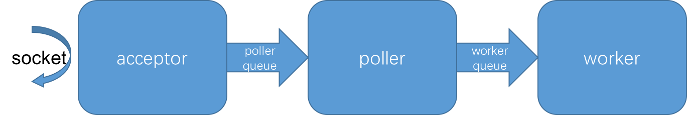

## 数据采集

我们先从数据采集开始。金融风控场景下的一种数据采集方式是收集从手机或网页等客户端发送来的事件。
这些事件包含用户属性、行为、生物识别、终端设备信息、网络状况、TCP/IP协议栈等信息。
数据接收服务器收到这些事件后，对数据进行抽取、清洗和转换，然后发往下游的特征提取模块。
很显然，这是一种基于互联网的通信，我们的数据接收服务器就是一种Web服务器。
http/https是互联网最主要的应用层通信协议，没有特别必要，我们也采用http/https协议来进行客户端和数据接收服务器之间的数据通信。

确定数据通信协议后，我们还需要设计事件上报API。以REST（Representational State Transfer）风格为代表的API设计方式，
为我们提供了一个相对标准的API设计原则。
在REST风格指导下，我们设计数据上报API如下：

```
POST event/
{
	"user_id": "u200710918",
	"client_timestamp": "1524646221000",
	"event_type": "loan",
	"amount": 1000,
	"...": "..."
}
```

上面的请求表示向服务器上报一个事件，
用户账号`user_id`是u200710918，
发送时间戳`client_timestamp`是1524646221000，
事件类型`event_type`是loan，
金额`amount`是1000，
还有其它一些信息用`...`表示。
当然，这里只是为了示例，并不代表真实的数据。

现在，通信协议和API我们都设计好了，下面就来实现接收服务器。


### Spring Boot

我们要实现的数据接收服务器是一种Web服务器［备注：诸如ftp服务器等也能提供数据接收服务］。
说到REST风格的Web服务器开发，大部分以Java为编程语言的开发者，首先想到的会是Spring系列中的Spring Boot。
毫无疑问，Spring Boot使得用Java做Web服务开发的体验相比过去有了极大的提升。几乎在数分钟之内，一个可用的Web服务就可以开发完毕。
所以我们也先用Spring Boot来实现数据接收服务器。

实现如下：

```
@Controller
@EnableAutoConfiguration
public class SpringDataCollector {
    private static final Logger logger = LoggerFactory.getLogger(SpringDataCollector.class);

    private JSONObject doExtractCleanTransform(JSONObject event) {
        // TODO: 实现抽取、清洗、转化具体逻辑
        return event;
    }

    private final String kafkaBroker = "127.0.0.1:9092";
    private final String topic = "collector_event";
    private final KafkaSender kafkaSender = new KafkaSender(kafkaBroker);

    @PostMapping(path = "/event", produces = MediaType.APPLICATION_JSON_UTF8_VALUE)
    @ResponseBody()
    public String uploadEvent(@RequestBody byte[] body) {
        // step1: 对消息进行解码
        JSONObject bodyJson = JSONObject.parseObject(new String(body, Charsets.UTF_8));

        // step2: 对消息进行抽取、清洗、转化
        JSONObject normEvent = doExtractCleanTransform(bodyJson);

        // step3: 将格式规整化的消息发到消息中间件kafka
        kafkaSender.send(topic, normEvent.toJSONString().getBytes(Charsets.UTF_8));
        
        // 通知客户端数据采集成功
        return RestHelper.genResponse(200, "ok").toJSONString();
    }

    public static void main(String[] args) throws Exception {
        SpringApplication.run(SpringDataCollector.class, args);
    }
}
```

***说明*** 为了节省篇幅，本书中的样例代码均只保留了主要逻辑以阐述问题，大部分都略去了异常处理和日志打印。
如需将这些代码用于真实产品环境，需要读者自行添加异常处理和日志打印相关内容。
异常处理和日志打印是可靠软件的重要因素，读者在编程开发时请务必重视这两点。

在上面的示例代码中，我们在`uploadEvent`中实现了事件上报接口。
当收到消息后，首先对消息进行了解码，解码的结果用一个通用json类JSONObject来表示，
然后在这个JSONObject对象基础上进行抽取、清洗和转化，规整化成我们所定义格式的数据，
最后将格式统一的数据发送到消息中间件kafka中去。

似乎一切都很顺利、完美。

但在实际生成上线后，晴朗的天空却渐渐出现三朵乌云：
1、随着用户越来越多，接收服务器的连接数也越来越多，甚至可能出现同时有成千上万个连接的状态。
2、doExtractCleanTransform比较耗时，可能是计算比较复杂，也可能是需要较多的外部服务，也就是较多的IO操作。
3、逐条往kafka发送消息，吞吐量也不尽如人意。


#### 连接器BIO与NIO

我们先来看接收服务器的连接数的问题。
当我们使用Spring Boot来做web服务开发时，默认情况下，spring boot使用的是tomcat容器。
在早期的tomcat版本中，默认使用的是BIO的连接器模式，虽然在现在的版本中已经去掉了BIO的模式，
而且已经默认采用了NIO的连接器。但是我们还是来比较下BIO和NIO连接器的区别，
这样会对我们理解同步和异步机制，编写高性能程序都有很大的帮助。
事实上，从BIO演变到NIO的过程也体现出了"流"这种编程方式的优势和价值所在。在后面的章节中还会再次提到。

##### BIO

当Tomcat在使用BIO连接器时，初始化的时候先创建好一批worker线程，并用栈的方式来管理这些workers。
在acceptor接收到一个socket之后，就从栈中取出一个worker，并将socket交给该worker由其全权处理，acceptor不再管这个socket。
Worker从socket中读取数据，进行处理后，将结果写回socket，然后将socket关闭。至此完成一次请求处理。
这其实也是一个异步过程，因为acceptor将socket交给worker之后就脱手(hand off)不管了，不需要worker给acceptor返回结果。
但问题在于，如果所有worker都在忙，没有worker可用时，acceptor必须等待直到栈中有一个worker可用方可。

<div align="center">
<div style="text-align: center; font-size:50%">图2.2 tomcat-bio原理</div>

</div>

很明显，如果worker处理很慢，比如计算逻辑较复杂或外部IO较多，那么可用worker会很容易耗尽，这个时候acceptor就会阻塞在等待worker可用，而不能接收新的socket。
这进一步会造成，当worker完成socket处理后，它却不能够及时拿到新的socket处理，而必须等到acceptor完成接受新的socket之后，才能开始新的工作。
经过以上分析，我们发现这种处理方案的性能表现会非常低下，一方面acceptor和worker很忙碌，而另一方面acceptor和worker却要时不时的相互等待，等待的时候处于空闲状态。
这实际上就使得CPU和网络IO很多时候处于空闲状态，资源大量空闲浪费，处理能力却表现低下。

为了使得资源能够充分利用，一种简单的方案就是增加worker的数量。理想情况下，如果有成千上万甚至上百万个worker来处理socket的话，acceptor就再也不用担心worker不够用了，因为任何时候总会有worker可用。

但是理想虽然很丰满，现实却很骨感。真实的情况是，我们现在用的大多数操作系统在处理上万个甚至只需大几千个线程时，性能就会变得非常低下。
因为这些线程的调度和切换会耗费大量的系统时间，使得正真用于任务计算的有效CPU时间变的更少。这又是另一种形势的资源浪费了。
线程过多的情况下，还会导致需要大量内存的问题，因为每个线程都会需要自己独立的线程栈，
而一般情况下，线程栈在数百K甚至数M，大量线程会占用大量内存。
当然，更多线程还是有好处的，由于各个线程会触发IO任务，IO资源还是会被用得更加充分。

既然不能在一台机器上运行太多线程，很自然的想到，我们可以用多台机器来分担这些计算任务。
不错，这是种很好的方法，在服务节点之前我们添加一个诸如nginx这样的辅助均衡器，就可以有效地将请求分发到多台机器上去。

但是，我们不能立刻就这样做。因为，作为有极客精神的程序员，同时也是为了我们的钱包着想，
在将一台机器的资源充分压榨光前，我们不能简单地选择通过扩充机器的方式来提高处理能力和性能。

于是进一步思考，我们想要做的是不浪费CPU和IO资源，如果这些资源能够更充分利用，势必也会提高性能。

如果acceptor不做阻塞，它可以进行新的socket接收，触发更多的网络Io操作，
将这些新接收的socket放到一个任务队列中暂存起来，那么worker在处理完一个socket之后，
能立刻拿到一个新的socket进行处理。这样以来acceptor可以不停的接受新的socket，而worker们的任务也被安排得满满的。

因此BIO连接器方案缺陷的本质在于，中间没有一个buffer来缓存acceptor已经接收的socket，
使得acceptor和worker在处理步调上耦合起来，即acceptor需要等到有空闲的worker才能做后续处理。

既然找到了问题的本质，即acceptor和worker在处理步调上耦合得太紧，那我们只需将这两种任务的执行完全分开就好了。
前面讲到，通过buffer的方式就可以将两者的处理步调解耦。而这，正是Tomcat NIO所做的。
下面我们来看Tomcat NIO的工作原理。


##### NIO

在本书写作时，最新版本的Tomcat已经将NIO作为默认连接器。
当Tomcat在使用NIO连接器时，初始化时启动acceptor线程和poller线程，acceptor线程通过accept接收新的连接请求。
当acceptor接收到新的socket时，先将其放入poller的输入队列中，poller从其输入队列种取出socket，
然后注册到一个selector对象，selector对象用于管理注册在其上的所有socket，当这些socket中有socket可读取时，
就将其挑选出来，交给Worker来处理。

<div align="center">
<div style="text-align: center; font-size:50%">图2.3 tomcat-nio原理</div>

</div>

从上面的过程中可以看出，Tomcat的NIO和BIO实际上在acceptor接收socket和worker处理socket数据的过程是一致的，
并且他们的处理也同样是阻塞的。但是NIO通过中间的poller将acceptor和worker这两者的执行隔离开来，
不让他们会因为对方的阻塞而影响自己的连续运行，两者都能尽其所能地工作，更加充分利用CPU和IO资源。
同时因为有了poller这个中间人做缓冲，acceptor能够接将接收到的请求交给poller暂存，由poller在有空闲worker时再分配给worker处理，
这样tomcat能够同时接收的连接数也更多。
当然这样会要求poller自身的处理逻辑必须非常轻量，没有过多IO和复杂计算，否则会出现和BIO一样的问题。
至此，我们采用了NIO的方式来分离请求连接和请求处理，使得接收服务器能够同时支持的连接数大大提高，而使用的线程却最多只需成百上千个。
大量连接的问题得到解决。

#### worker处理时延很高

但是新的问题再次出现：worker的处理非常耗时，导致虽然poller接收了很多的socket，但是worker处理的很慢，
使得socket在poller处长时间滞留，最终导致每个请求的处理时延也非常高。
我们现在就来分析worker的处理，在前面展示的数据采集代码中，我们将可能的处理逻辑用`doExtractCleanTransform()`这个函数做了封装。
现在我们来分析下`doExtractCleanTransform()`可能耗时的原因。

##### CPU密集型任务

CPU密集型任务是指在处理过程中，主要依靠CPU（这里不考虑协处理器，比如GPU、FPGA等等）运算来完成的任务。
对于CPU密集型作业，优化的内容主要是算法本身，除此以外优化的空间并不大。
因为如果CPU已经跑满，对于相同的计算量，这个时候是多线程还是单线程、是同步还是异步，并不会减少计算时间。
相反，如果线程过多，操作系统会花费更多的时间在线程调度上，用于有效计算的时间相应减少，反而会降低性能，增加时延。
算法优化相关的内容，包括改进算法、合理使用内存资源、使用协处理器如GPU或FPGA等、针对JVM和CPU执行优化编程甚至使用汇编等等。
但这些内容与程序整体框架并没直接关系，本书不做详细讨论。

##### IO密集型任务

IO密集型任务是指在处理过程中，有很多IO操作的任务。IO操作包括磁盘IO和网络IO。
磁盘IO通常是在写日志或做数据持久化。
网络IO则通常是在往消息中间件发送数据，或者是在调用外部服务，如数据库服务、其它微服务模块等等。
相比CPU密集型任务而言，IO密集型任务是大多数Java开发者面临的更现实的问题。
因为大部分业务系统和基础框架，都会涉及到数据持久化、数据库访问或对其它服务模块的调用。

IO密集型任务，如果计算逻辑简单，也就是说对CPU资源要求不多的任务，最方便有效的方法就是增加线程数。
让大量的线程触发更多的IO请求，这样就可以将IO资源充分利用。
为什么这个时候可以使用大量线程呢？这是因为，操作系统对线程的调用占用的是CPU资源，
如果计算逻辑本身比较简单，对CPU资源要求不高，那么这部分资源不妨就给操作系统做线程调度。

##### IO和CPU都比较密集

当IO和CPU都比较密集的时候，问题就复杂很多了。

我们在前边说到，使用大量线程可以提高IO利用率。为什么这样？这是因为当操作系统碰到io或诸如sleep这样的调用时，
会涉及到系统调用，当操作系统进行系统调用时会从用户态进入内核态，当操作系统从内核态返回用户态时，
会有一次进程调度的机会。这样对于进行了io操作的进程，他会被调度出去，因为他已经触发了io请求并需要时间等待io请求结果返回，
操作系统就让他先晾在一旁等等，也不浪费cpu资源。当这个线程被调度出去后，其它线程会被调度执行，利用cpu进行计算，
然后在碰到io请求的时候，就会和刚才的线程一样，被调度出去等待一会，将cpu让给其它线程。
当io请求的数据准备好了的时候，这些线程又会重新获得被调度执行的机会，从而继续之前的程序执行。

​从上面进程执行io系统调用的过程可以看出，当进程进行io请求时，操作系统本身并不会阻塞在等待io返回，
而是会通过调度让其它线程利用cpu进行计算。因此，当大量线程进行io请求时，这些io请求都会被触发，
使io的任务被安排得满满的，充分利用了io资源。
很显然，操作系统在系统调用时触发调度的原因就是在试图充分使用好cpu资源，同时如果io请求较多，io资源也会被充分利用，这样是非常合理的。
只是当进程非常多时，过于频繁地进出内核态，调度过于频繁，而进程调度和状态切换这些事情都是由cpu来做的，
这样cpu将过多时间用于系统调度和状态切换，用于进行有效程序执行的时间就变少了，
这又是一种形式的CPU资源浪费，因为这些cpu时间没有用于有效程序任务计算。

​那有没有一种类似于线程，在碰到io调用时不会阻塞，能够将cpu让出去，让cpu执行其它计算，
等到io数据准备好了再继续执行，同时还不占用过多cpu在调度和状态切换的办法呢？
有！这就是纤程，也叫协程。纤程是一种用户态的线程，其调度逻辑在用户态实现，这样就避免了过多的进出内核态进行线程调度和状态切换。
事实上，纤程才是最理想的线程！那纤程是怎样实现的呢？
就像线程一样，关键是纤程在执行的过程中，能在恰当的时刻，恰当的地方被中断，然后被调度出去，让其它线程使用cpu资源。
先来考虑io，前面说到操作系统进行io操作时，一定会进行调度，这个是不可避免的。
但问题的关键不是避免io操作，而是要避免过多的线程调度和状态切换。
我们可以将io操作都委托给少数几个固定的线程，这样只需要少量线程负责io操作，
另外少量线程负责io状态检查和纤程执行的调度，再用适量的线程执行纤程。这样就可以大量创建纤程，而且只需要少量的线程即可。

回想下之前Tomcat NIO连接器的实现机制，是不是这种纤程和Tomcat NIO连接器的工作机制有异曲同工之妙。
事实上正是如此，理论上讲，纤程才是将异步执行过程封装得最好的方案。
因为他像操作系统一样封装了所有的异步复杂性，在提供同步api的同时还拥有了非阻塞io的优势！
当然，最最理想的纤程是完全像线程那样，连cpu的执行都不阻塞，
也就是说纤程在执行非io操作的时候，也能够被调度出去，让cpu执行其它纤程的逻辑。
这样做也是可能的，只是这样做需要cpu中断的支持，线程的调度在内核态完成，因此可以直接得到cpu中断支持。
但位于用户态的纤程，要得到中断支持相对会更繁琐，需要进出内核态，再考虑到cpu中断时的上下文保存，实现的复杂性和性能代价也是非常大的。
所以通常而言，用户态的纤程都只会做到io执行非阻塞，cpu执行依旧阻塞。
当然，有些纤程的实现方案，如python里的绿色线程，提供了主动让出cpu让其它程序片段执行的方案，
这种调度其实是由开发人员自己控制的，但也算是对实现部分cpu执行非阻塞的一种尝试了。

既然纤程有这么多好处，提供同步API的同时拥有非阻塞IO的优点、可以大量创建纤程而只会占用少量线程，
这样开发起来，不管多么复杂的逻辑，只需要放在纤程里，然后起个几十万甚至上百万个纤程，就可以做到高并发、高性能了。
一切都很美好不是？
可是为什么到现在为止，我们大多数java开发人员还没有用上纤程呢？
或者说，为什么至少在java的世界里，时至今日纤程还没有大行其道呢？
其实，这与纤程的实现有关，从前面的分析中，纤程要在IO调用时，具备能够调度出去的能力。线程是由操作系统完成调度了，那纤程呢？
纤程不能依赖操作系统，因为纤程的调度器和状态切换都必须在用户态完成，这就需要纤程在执行IO操作时能够被纤程调度器拦截。
那怎样拦截呢？这里就用到我们常说的AOP技术了，我们需要在纤程上将所有与IO操作相关的API进行AOP拦截，这样才能给调度器调度纤程的机会。
所以，如果要实现纤程，需要同时提供一套与之对应的IO操作API，然后开发程序时涉及IO相关的部分都由这套IO操作API来完成。
如果所有代码开发都从新开始，IO相关的操作只用这套API，那么使用这个纤程方案就是非常可行的。
但是想想真实的情况，这样做的可能性就很低了。因为JDK库、各种第三方库等等，里面用到的IO操作API都不是单独某个开发团队可控的。
所以纤程需要拦截所有IO操作的这个必要条件很难达成。
那是不是这意味Java平台上真实可用的纤程就实现不了了呢？不是的。
笔者认为至少有三种方案来实现纤程：
1. 修改JVM的源码，在JVM层面拦截所有IO操作API；
2. 修改JDK的源码，在JDK层面拦截所有IO操作API；
3. 采用动态字节码技术，动态拦截所有IO操作API。
其中第三种方案，已有开源实现Quasar，读者如果感兴趣可以自行研究，在此不再展开。
但是笔者认为，Quasar虽然确实实现了IO拦截，实现了纤程，但是对代码的侵入性还是太强，
如果读者要在生成环境使用，还是得做好严格的测试才行。

另外必须要提到的是，在纤程之上，通常有一种系统设计模式，也就是Actor模式。
所谓Actor模式，是指用Actor来表示一个个的活动实体，这些活动实体之间通过消息的方式进行通信。
游戏开发是最适合使用Actor模式的场景之一。
比如Dota里面的每个小兵，就可以用一个Actor来表示，如果要小兵去A塔，
就给这个小兵Actor先发一条消息，让其移动到塔下，再发一条消息，让其攻击塔。
当然Actor系统本身不只是为了游戏开发而诞生，它是一种通用的应对大规模并发活动场景的系统设计方案。

最有名的Actor系统非Erlang莫属，而Erlang系统正是构建在纤程之上。再比如Quasar也有自己的Actor系统。
也有不是构建在纤程上的Actor系统，比如Akka。不过由于Akka不是构建在纤程上，它在IO阻塞时也就只能由线程调度出去，
所以Akka使用的线程也不宜过多。虽然在Akka里面能够创建上万甚至上百万个Actor，但是这些Actor被分配在少数线程里面执行，
如果这些Actor里面IO操作较多，势必分配在同一个线程里面的Actor会出现排队和等待，
排在后面的Actor只能等到前面的Actor完成IO操作和计算后才能被执行，这极大地影响了程序的性能。
虽然Akka采用ForkJoinPool的work-stealing工作机制可以让一个线程从其他线程的任务队列里面偷取actor任务来执行，
对actor的阻塞有一定缓解，但是这并没有从本质上解决问题，因为问题的根源在于Akka使用的是线程而非纤程。
线程不能过多的限制，使得其不能像基于纤程的Actor系统那样给每个Actor分配一个纤程，而只能是多个Actor共用同一个线程。
如果Actor较少，每个Actor都能分配一个纤程或线程，那么这使用纤程或线程的差别就不是非常明显了。

不过Actor这种系统模式，本质上是一种针对并发活动实体的系统设计方案，与底层是采用线程还是纤程并无直接关系。
只是说，如果底层采用线程，那么在存在大量并发活动实体时，Actor的代码逻辑就不宜做过多IO操作甚至是Sleep，
当然IO操作是难以避免的，为了减少IO对其它计算的影响，应尽量为涉及IO操作的Actor分配专门的线程，
不让这些Actor和其它非IO操作的Actor分配到相同的线程里面，以影响到非IO操作Actor的性能。
比如游戏里的小兵去A塔，这种操作是单纯的CPU操作，不涉及IO，采用线程的Actor方案就对性能影响不大。
另外对于并发活动实体不多，也就是只需要少数Actor实体的场景，是采用线程还是纤程对解决问题的影响也不会太大，
比如早期版本Spark底层的RPC机制就是通过Akka来实现，
因为这个时候考虑更多的是异步RPC不阻塞系统其它部分执行带来的性能提升，采用Akka实现的异步RPC在使用时显得非常方便，
这与Actor模型本身的并发能力并没直接联系。
换言之，在RPC的场景里，只需为数不多的Actor即可，而不像在游戏里那样，为每一个小兵分配一个Actor。
所以这个时候使用采用基于线程的Actor方案Akka，足以保证执行的性能。


那除了纤程外，还有没有方法能够同时保证CPU资源和IO资源都能高效使用呢？当然也是有的。
前面说到纤程是封装得最好的非阻塞IO方案。所以如果不用纤程，那就直接用非阻塞IO了，
通常而言，非阻塞IO会结合异步编程使用，这样可以充分利用好IO资源和CPU资源。

不过并非所有的情况都能够使用非阻塞IO。比如JDBC驱动提供的数据库API都是同步的，
对于这种同步的API，如果直接使用它们，在数据库操作较多的时候会显著地影响到性能。
那应该如何处理这种同步IO的API呢？

如果记住了非阻塞IO的核心好处，即不阻塞CPU执行和减少使用的线程数，那很容易处理这种同步IO的API问题。
将这些同步IO的API委托给特定线程或线程池去执行，这样做有两个好处：
1. 如果采用异步回调的方法等待IO操作结果，那么所有申请IO操作的线程都不用阻塞，
只需要少数线程就可以发起大量的IO操作请求，从而充分利用IO资源，同时更少的线程也减少了操作系统调度开销。
2. 将所有IO操作委托给特定线程或线程池，就提供了对请求进行批次处理的机会，比如redis的pipeline机制、http的pipeline机制等等，
这样即使是同步等待IO操作结果，也能对提高性能有所帮助。

针对异步编程，在java8之前，ExecutorService类提供了初步的异步编程支持。
ExecutorService类的`execute()`方法就提供了异步执行的机制，而`submit()`方法提供了一种半异步半同步的机制，
这是因为`submit()`是在异步地执行任务，但是需要同步地等待结果。
来自Google的Java库Guava里的SettableFuture类，为Future提供了回调的机制，从而实现了正真意义上方便好用的异步编程API。
借鉴了Guava的SettableFuture类等异步编程API，从Java8开始，jdk提供了CompletableFuture类。
可以说CompletableFuture类里的API汇集了各种异步编程的场景和需求，是异步编程API的集大成者，而且还在继续完善和增强。
强烈建议读者仔细阅读CompletableFuture类的API文档，会对编写高性能程序有极大帮助。

除了这些偏底层的异步编程库以外，还有很多提供更高层异步编程API的库或框架。
比如Akka、Vert.x、Reactive、Netty等等，这些框架大都是基于事件或消息驱动。
抛开各种不同的表现形式，从某种意义上来讲，异步和事件或消息驱动这两个概念是等同的。

关于异步编程的内容，在后续的章节中还会结合实际案例来做讲解，届时读者会有更深入理解。

### Netty

前面采用了Spring Boot来实现基于http/https协议的事件上报API。
有些时候，可能我们需要使用其它非http/https的协议，比如直接基于UDP或TCP协议开发自定义协议等等。在这种情况下，使用Netty会更加合适。
Netty是一个基于NIO的异步事件驱动网络应用框架，用于快速开发具有可维护性的高性能协议服务器和客户端。
通过Netty，我们可以实现自己的事件上报协议。下面，我们就用Netty来实现同样的事件上报接口，即：

```
POST event/
{
	"user_id": "u200710918",
	"client_timestamp": "1524646221000",
	"event_type": "loan",
	"amount": 1000,
	"...": "..."
}
```

实现如下：

```
public static void main(String[] args) {
    final int port = 8081;
    final EventLoopGroup bossGroup = new NioEventLoopGroup();
    final EventLoopGroup workerGroup = new NioEventLoopGroup();
    try {
        final ServerBootstrap bootstrap = new ServerBootstrap()
                .group(bossGroup, workerGroup)
                .channel(NioServerSocketChannel.class)
                .childHandler(new ServerInitializer())
                .option(ChannelOption.SO_BACKLOG, 1024);

        final ChannelFuture f = bootstrap.bind(port).sync();
        logger.info(String.format("NettyDataCollector: running on port[%d]", port));

        f.channel().closeFuture().sync();
    } catch (final InterruptedException e) {
        logger.error("NettyDataCollector: an error occurred while running", e);
    } finally {
        bossGroup.shutdownGracefully();
        workerGroup.shutdownGracefully();
    }
}

public class ServerInitializer extends ChannelInitializer<SocketChannel> {

    private static final int MAX_CONTENT_LENGTH = 1024 * 1024;

    @Override
    public void initChannel(SocketChannel ch) throws Exception {
        ch.pipeline().addLast("http-codec", new HttpServerCodec());
        ch.pipeline().addLast(new HttpObjectAggregator(MAX_CONTENT_LENGTH));
        ch.pipeline().addLast("handler", new ServerHandler());
    }
}

public class ServerHandler extends
        SimpleChannelInboundHandler<HttpRequest> {
    private static final Logger logger = LoggerFactory.getLogger(NettyDataCollector.class);

    private final String kafkaBroker = "127.0.0.1:9092";
    private final String topic = "collector_event";
    private final KafkaSender kafkaSender = new KafkaSender(kafkaBroker);

    private JSONObject doExtractCleanTransform(JSONObject event) {
        // TODO: 实现抽取、清洗、转化具体逻辑
        return event;
    }

    @Override
    protected void channelRead0(ChannelHandlerContext ctx, HttpRequest req)
            throws Exception {

        byte[] body = readRequestBodyAsString((HttpContent) req);
        // step1: 对消息进行解码
        JSONObject bodyJson = JSONObject.parseObject(new String(body, Charsets.UTF_8));

        // step2: 对消息进行抽取、清洗、转化
        JSONObject normEvent = doExtractCleanTransform(bodyJson);

        // step3: 将格式规整化的消息发到消息中间件kafka
        kafkaSender.send(topic, normEvent.toJSONString().getBytes(Charsets.UTF_8));

        // 通知客户端数据采集成功
        sendResponse(ctx, OK, RestHelper.genResponse(200, "ok").toJSONString());
    }
}

```

在上面的代码中，使用了HttpServerCodec来将接收的数据按照http协议格式进行解码，
然后解码后的数据交由ServerHandler处理，针对消息的解码、ECT、发送消息中间件等过程和Spring Boot实现相似。


### 异步处理

在前面我们分别Spring Boot和Netty实现了事件上报接口，并且它们都采用NIO的框架。
那是不是使用了NIO就能让CPU和IO资源的使用效率完全释放出来呢？这可不一定。
仔细查看我们前面的实现方式会发现，虽然我们采用了NIO的方案，使得请求的处理和请求的接收分离开来。
但是，在处理请求的时候，我们都是用同步的方式，对消息解码、做ECT、发送到消息中间件，然后给客户端响应结果。
换言之，不管是在Spring Boot里，还是在Netty里，我们在之前的实现方式中，worker对请求的处理都是采用同步的方式！
在讨论IO和CPU密集性问题的时候，我们知道在IO和CPU都很密集的情况下，结合NIO和异步处理才能尽可能同时提高IO和CPU使用效率。

下面我们就看如果用异步的方式来改进之前的Spring Boot实现和Netty实现。

#### Spring Boot异步实现

Spring Boot对创建异步执行的方法提供了非常方便的接口和注解。下面就是用异步的方式来实现事件上报接口：

```
@Async
@PostMapping(path = "/event", produces = MediaType.APPLICATION_JSON_UTF8_VALUE)
@ResponseBody()
public CompletableFuture<String> uploadEvent(@RequestBody byte[] body) throws InterruptedException {
    logger.info(String.format("current thread[%s]", Thread.currentThread().toString()));

    // step1: 对消息进行解码
    JSONObject bodyJson = JSONObject.parseObject(new String(body, Charsets.UTF_8));

    // step2: 对消息进行抽取、清洗、转化
    JSONObject normEvent = doExtractCleanTransform(bodyJson);

    // step3: 将格式规整化的消息发到消息中间件kafka
    kafkaSender.send(topic, normEvent.toJSONString().getBytes(Charsets.UTF_8));
    
    // 通知客户端数据采集成功
    return RestHelper.genResponseFuture(200, "ok");
}

@Bean
public Executor taskExecutor() {
    ThreadPoolTaskExecutor executor = new ThreadPoolTaskExecutor();
    executor.setCorePoolSize(2);
    executor.setMaxPoolSize(2);
    executor.setQueueCapacity(500);
    executor.setThreadNamePrefix("AsyncSpringDataCollector-");
    executor.initialize();
    return executor;
}

public static CompletableFuture<String> genResponseFuture(int code, String msg) {
    return CompletableFuture.completedFuture(genResponseString(code, msg));
}
```

在上面的代码中，我们使用`taskExecutor()`指定了一个用来执行异步方法的线程池，
然后使用`@Async`注解指示uploadEvent()方法的执行应该交由`taskExecutor()`指定的线程池来执行，
由于是异步执行，而且为了将更多的选择权和控制权交给开发者，使用`@Async`方法注解的方法，返回值类型是CompletableFuture类。

经过上面一翻改造，worker的执行就变为异步的了，即`uploadEvent()`的执行不在NIO Worker线程中，
而在`taskExecutor()`指定的异步执行线程中。我们可以看下执行的日志：

```
2018-05-08 12:57:00.659  INFO 55562 --- [DataCollector-1] c.a.b.c.d.s.a.AsyncSpringDataCollector   : current thread[Thread[AsyncSpringDataCollector-1,5,main]]
2018-05-08 12:57:02.115  INFO 55562 --- [DataCollector-2] c.a.b.c.d.s.a.AsyncSpringDataCollector   : current thread[Thread[AsyncSpringDataCollector-2,5,main]]
2018-05-08 12:57:03.492  INFO 55562 --- [DataCollector-1] c.a.b.c.d.s.a.AsyncSpringDataCollector   : current thread[Thread[AsyncSpringDataCollector-1,5,main]]
2018-05-08 12:57:04.473  INFO 55562 --- [DataCollector-2] c.a.b.c.d.s.a.AsyncSpringDataCollector   : current thread[Thread[AsyncSpringDataCollector-2,5,main]]
2018-05-08 12:57:05.405  INFO 55562 --- [DataCollector-1] c.a.b.c.d.s.a.AsyncSpringDataCollector   : current thread[Thread[AsyncSpringDataCollector-1,5,main]]
2018-05-08 12:57:06.073  INFO 55562 --- [DataCollector-2] c.a.b.c.d.s.a.AsyncSpringDataCollector   : current thread[Thread[AsyncSpringDataCollector-2,5,main]]
2018-05-08 12:57:06.919  INFO 55562 --- [DataCollector-1] c.a.b.c.d.s.a.AsyncSpringDataCollector   : current thread[Thread[AsyncSpringDataCollector-1,5,main]]
2018-05-08 12:57:07.718  INFO 55562 --- [DataCollector-2] c.a.b.c.d.s.a.AsyncSpringDataCollector   : current thread[Thread[AsyncSpringDataCollector-2,5,main]]
```

正如我们分析的一样，日志显示`uploadEvent()`是在`taskExecutor()`指定的线程池中执行。
对比下之前采用同步worker实现时的日志：

```
2018-05-08 11:18:57.269  INFO 55367 --- [nio-8080-exec-1] c.a.b.c.d.s.sync.SpringDataCollector     : current thread[Thread[http-nio-8080-exec-1,5,main]]
2018-05-08 11:19:06.881  INFO 55367 --- [nio-8080-exec-2] c.a.b.c.d.s.sync.SpringDataCollector     : current thread[Thread[http-nio-8080-exec-2,5,main]]
2018-05-08 11:19:11.133  INFO 55367 --- [nio-8080-exec-3] c.a.b.c.d.s.sync.SpringDataCollector     : current thread[Thread[http-nio-8080-exec-3,5,main]]
2018-05-08 11:19:15.226  INFO 55367 --- [nio-8080-exec-4] c.a.b.c.d.s.sync.SpringDataCollector     : current thread[Thread[http-nio-8080-exec-4,5,main]]
2018-05-08 11:19:18.240  INFO 55367 --- [nio-8080-exec-5] c.a.b.c.d.s.sync.SpringDataCollector     : current thread[Thread[http-nio-8080-exec-5,5,main]]
2018-05-08 11:19:20.811  INFO 55367 --- [nio-8080-exec-6] c.a.b.c.d.s.sync.SpringDataCollector     : current thread[Thread[http-nio-8080-exec-6,5,main]]
2018-05-08 11:21:05.828  INFO 55367 --- [nio-8080-exec-8] c.a.b.c.d.s.sync.SpringDataCollector     : current thread[Thread[http-nio-8080-exec-8,5,main]]
2018-05-08 11:21:09.456  INFO 55367 --- [nio-8080-exec-9] c.a.b.c.d.s.sync.SpringDataCollector     : current thread[Thread[http-nio-8080-exec-9,5,main]]
2018-05-08 11:21:10.835  INFO 55367 --- [io-8080-exec-10] c.a.b.c.d.s.sync.SpringDataCollector     : current thread[Thread[http-nio-8080-exec-10,5,main]]
2018-05-08 11:21:12.018  INFO 55367 --- [nio-8080-exec-1] c.a.b.c.d.s.sync.SpringDataCollector     : current thread[Thread[http-nio-8080-exec-1,5,main]]
```

从日志中可以看出，同步worker是在worker线程池中执行的，所以如果worker中的IO比较多，
这些线程会很容易耗尽，从而降低CPU和IO资源的使用效率。

可是将上面的`uploadEvent()`异步执行后，还远没有达到我们提高CPU和IO资源使用率的目的。
事实上，相比之前同步执行`uploadEvent()`的方案，现在的做法并没优作出改善，甚至结果更糟，
因为这个时候虽然`uploadEvent()`是在`taskExecutor()`指定的线程池中异步执行了，
但是也只是执行换了个地方而已，而我们在`taskExecutor()`中只分配了两个线程，
相比nio worker默认的200个线程，显然情况更糟糕了。

那这样做的意义何在？事实上，将`uploadEvent()`经过异步执行改造后，
为我们提供了将`uploadEvent()`内部执行步骤完全异步化的编程环境。
当我们使用同步的执行方案时，`uploadEvent()`即使内部执行步骤是异步的，它也要同步等待，拿到一个最终执行结果才能返回，
也就是类似于`Future.get()`的效果，这对于worker线程而言，就是个同步执行的过程。
但是当我们使用异步的执行方案后，`uploadEvent()`返回的CompletableFuture对象实际上包含了任务完成后的回调函数，
在`uploadEvent()`内部，我们可以把步骤根据业务步骤或计算需要的资源类型，精细划分成多个异步执行步骤，
每个步骤使用自己各自的线程池。这样，我们就真正意义上地将worker的执行完全异步化了。而从CompletableFuture角度来看，
各个步骤的CompletableFuture对象实际上就构成了一个异步依次调用的任务链，而且将任务分配到各个步骤各自的线程池中执行，
完全减轻了`taskExecutor()`这个执行异步方法线程池的负担，这正是合理的使用方法。

下面就是将`uploadEvent()`内部执行步骤完全异步化的具体实现：

```
// step1: 对消息进行解码
private JSONObject decode(byte[] event) {
    String jsonString = new String(event, Charsets.UTF_8);
    return JSON.parseObject(jsonString);
}

// step2: 对消息进行抽取、清洗、转化
private JSONObject doExtractCleanTransform(JSONObject event) {
    // TODO: 实现抽取、清洗、转化具体逻辑
    return event;
}

// step3: 将格式规整化的消息发到消息中间件kafka
private String send(JSONObject event) {
    kafkaSender.send(topic, event.toJSONString().getBytes(Charsets.UTF_8));
    return RestHelper.genResponseString(200, "ok");
}

final private Executor decoderExecutor = createExecutor(2, "decoder");
final private Executor ectExecutor = createExecutor(8, "ect");
final private Executor senderExecutor = createExecutor(2, "sender");

@Async
@PostMapping(path = "/event", produces = MediaType.APPLICATION_JSON_UTF8_VALUE)
@ResponseBody()
public CompletableFuture<String> uploadEvent(@RequestBody byte[] body) throws InterruptedException {
    logger.info(String.format("current thread[%s]", Thread.currentThread().toString()));
    return CompletableFuture
            .supplyAsync(() -> this.decode(body), this.decoderExecutor)
            .thenApplyAsync(this::doExtractCleanTransform, this.ectExecutor)
            .thenApplyAsync(this::send, this.senderExecutor)
            .exceptionally(e -> {
                logger.error(String.format("unexpected exception, body[%s]", JSONObject.toJSONString(body)), e);
                return RestHelper.genResponseString(500, "服务器内部错误");
            });
}

@Bean
public Executor taskExecutor() {
    ThreadPoolTaskExecutor executor = new ThreadPoolTaskExecutor();
    executor.setCorePoolSize(2);
    executor.setMaxPoolSize(2);
    executor.setQueueCapacity(500);
    executor.setThreadNamePrefix("AsyncSpringDataCollector-");
    executor.initialize();
    return executor;
}

private ExecutorService createExecutor(int nThreads, String threadNamePrefix) {
    return Executors.newFixedThreadPool(nThreads,
            new ThreadFactoryBuilder().setNameFormat(threadNamePrefix + "-%d").build());
}
```

在上面的代码中，`uploadEvent()`内部采用CompletableFuture将解码、ECT、发送这三个步骤全部异步化，
并且每个步骤各自在专门为其分配的线程池中执行，避免了相互的干扰。
由于不同步骤相互独立运行，完全不依赖其它步骤，这样每个步骤都可以尽其所能地工作，充分利用了CPU资源和IO资源。
如果`doExtractCleanTransform()`中包含较多IO操作或者逻辑比较复杂，我们也可以采用同样的方式，
将`doExtractCleanTransform()`根据业务步骤和资源使用类型做更精细的划分，
再用CompletableFuture将各个步骤异步化，使IO和CPU资源的使用更加细化。
在进行IO操作时，如果可能，还可以采用NIO的方式，比如使用AsyncHttpClient代替HttpClient等等，这样可以更加精细地使用IO和CPU资源。
这里需要强调的是，在将一个复杂、耗时、阻塞的函数进行步骤细分时，除了按业务流程划分外，还需要考虑步骤使用资源的类型，
应该尽量将IO类型的步骤和非IO类型的步骤划分开来，这样一方面有利于IO和CPU资源各自的充分使用，
另一方面可以为IO资源使用留下更多的优化空间，比如对IO做批次化处理，同时也不会影响到其它步骤的代码实现。
另外，一定要为每个步骤分配不同的线程池，否则有可能出现不同步骤相互阻塞执行的情况，对性能造成极大影响。

在`uploadEvent()`内部步骤完全异步化后，执行日志如下：

```
2018-05-08 14:03:54.366  INFO 55673 --- [DataCollector-1] c.a.b.c.d.s.a.AsyncSpringDataCollector2  : current thread[Thread[AsyncSpringDataCollector-1,5,main]]
2018-05-08 14:03:54.367  INFO 55673 --- [      decoder-0] c.a.b.c.d.s.a.AsyncSpringDataCollector2  : decode thread[Thread[decoder-0,5,main]]
2018-05-08 14:03:54.550  INFO 55673 --- [          ect-0] c.a.b.c.d.s.a.AsyncSpringDataCollector2  : doExtractCleanTransform thread[Thread[ect-0,5,main]]
2018-05-08 14:03:54.551  INFO 55673 --- [       sender-0] c.a.b.c.d.s.a.AsyncSpringDataCollector2  : send thread[Thread[sender-0,5,main]]
2018-05-08 14:04:04.194  INFO 55673 --- [DataCollector-2] c.a.b.c.d.s.a.AsyncSpringDataCollector2  : current thread[Thread[AsyncSpringDataCollector-2,5,main]]
2018-05-08 14:04:04.196  INFO 55673 --- [      decoder-1] c.a.b.c.d.s.a.AsyncSpringDataCollector2  : decode thread[Thread[decoder-1,5,main]]
2018-05-08 14:04:04.198  INFO 55673 --- [          ect-1] c.a.b.c.d.s.a.AsyncSpringDataCollector2  : doExtractCleanTransform thread[Thread[ect-1,5,main]]
2018-05-08 14:04:04.200  INFO 55673 --- [       sender-1] c.a.b.c.d.s.a.AsyncSpringDataCollector2  : send thread[Thread[sender-1,5,main]]
2018-05-08 14:04:08.433  INFO 55673 --- [DataCollector-1] c.a.b.c.d.s.a.AsyncSpringDataCollector2  : current thread[Thread[AsyncSpringDataCollector-1,5,main]]
2018-05-08 14:04:08.434  INFO 55673 --- [      decoder-0] c.a.b.c.d.s.a.AsyncSpringDataCollector2  : decode thread[Thread[decoder-0,5,main]]
2018-05-08 14:04:08.435  INFO 55673 --- [          ect-2] c.a.b.c.d.s.a.AsyncSpringDataCollector2  : doExtractCleanTransform thread[Thread[ect-2,5,main]]
2018-05-08 14:04:08.435  INFO 55673 --- [       sender-0] c.a.b.c.d.s.a.AsyncSpringDataCollector2  : send thread[Thread[sender-0,5,main]]
```

从上面的日志中可以看出，每个步骤确实都是在各自的线程池中执行了。

这里还有个小彩蛋，就是`CompletableFuture`的`thenApply()`等一类方法在调用时，如果当时`CompletableFuture`本身已经完成了的话，
那么回调函数就会直接在调用`thenApply()`的线程上执行。针对这个问题，在使用线程局部量之类的技术时，需要稍微注意，
避免线程局部量的创建以及销毁和程序设计者预期有所不同。


#### Netty异步实现

在Netty中，也可以很方便地将worker执行请求从同步方式改成异步的方式，具体如下。

```
private static class RefController {
    private final ChannelHandlerContext ctx;
    private final HttpRequest req;

    public RefController(ChannelHandlerContext ctx, HttpRequest req) {
        this.ctx = ctx;
        this.req = req;
    }

    public void retain() {
        ReferenceCountUtil.retain(ctx);
        ReferenceCountUtil.retain(req);
    }

    public void release() {
        ReferenceCountUtil.release(req);
        ReferenceCountUtil.release(ctx);
    }
}

protected void channelRead0(ChannelHandlerContext ctx, HttpRequest req)
        throws Exception {
    logger.info(String.format("current thread[%s]", Thread.currentThread().toString()));
    final RefController refController = new RefController(ctx, req);
    refController.retain();
    CompletableFuture
            .supplyAsync(() -> this.decode(ctx, req), this.decoderExecutor)
            .thenApplyAsync(e -> this.doExtractCleanTransform(ctx, req, e), this.ectExecutor)
            .thenApplyAsync(e -> this.send(ctx, req, e), this.senderExecutor)
            .thenAccept(v -> refController.release())
            .exceptionally(e -> {
                try {
                    logger.error("exception caught", e);
                    sendResponse(ctx, INTERNAL_SERVER_ERROR,
                            RestHelper.genResponseString(500, "服务器内部错误"));
                    return null;
                } finally {
                    refController.release();
                }
            });
}
```

其中，`channelRead0()`函数的输入参数`ChannelHandlerContext`对象和`HttpRequest`对象，
在每次socket连接请求时都会创建新的对象，也就是说它们不是全局的，而是每次请求都会创建新的对象，
这就为我们提供了将它们在不同线程间自由传递并使用而不用担心并发问题的机会。
与前面在Spring Boot中所做的完全一样，我们同样将处理步骤细分成解码、ECT和发送到消息队列三个步骤，
然后使用CompletableFuture将这三个步骤异步执行化。
需要注意的是，由于netty会对其使用的部分对象进行分配和释放管理，在`channelRead0`方法返回时，
netty框架会立刻释放`HttpRequest`对象。
而当我们采用异步执行方案时，`channelRead0`方法会在将请求用CompletableFuture提交异步处理后立刻返回，
这个时候请求处理还没结束，甚至可能都还没有开始。
因此，在将请求用CompletableFuture提交异步处理之前，必须先调用`refController.retain()`来保持对象，
而在请求处理完后，再调用`refController.release()`来释放`HttpRequest`对象。


### 流量控制和反向压力

通过上面的改造，我们已经将worker的执行从外到内都异步化。这个时候，IO和CPU都可以毫无阻碍地尽情干活了，
IO和CPU资源的使用效率得到了充分释放。
似乎一切又变得非常美好！可是，新的问题很快又来了。
考虑Spring Boot的情况，通过异步化worker的执行后，NIO连接器可以不停接收新的socket请求，
这些请求经由poller之后，交给worker来处理，而worker因为使用了异步执行的方案，
worker对socket的处理又是交给了各个步骤的executor来异步执行。
在这整个过程中，完全没有阻塞的地方。
只是，NIO连接器接收的新socket及其触发的各个步骤的任务都被隐式地存放在了各处的executor任务队列中。
如果worker内部的各个步骤处理的足够快，那么executor中的任务都能够及时被处理，这样不会存在问题。
但是，一旦有某个步骤的处理速度比不上NIO连接器接收新socket的速度，
那么executor任务队列中的任务就会不停增长，而executor任务队列默认又是非阻塞且不限容量的，
这样当任务队列里积压的任务越来越多时，终有一刻，JVM的内存会被耗尽，抛出OOM系统错误后，程序异常退出。
不仅Spring Boot里的实现会这样，在Netty里情况也是如此。

实际上，这也是异步系统非常普遍、而且必须重视的问题。
在纤程里，可以通过指定最大纤程数量来限制内存的使用量，非常自然地控制了内存和流量。
但是在通常的异步系统里，如果不对执行的各个环节做流量控制，那么就很容易出现前面所说的OOM问题。
因为这种情况下，每个环节都会不管其下游的环节处理速度是否跟得上，
不停将其输出塞给下游的任务队列，这样只要上游输出速度超过下游处理速度的状况持续一段时间，
必然导致内存不断被占用，直至最终耗尽，抛出OOM灾难性系统错误。

为了避免这种OOM错误的问题，我们必须对上游输出给下游的速度做流量控制。
一种方式是严格控制上游的发送速度，比如每秒控制其只能发1000条消息，
但是这种粗糙的处理方案会非常低效，比如如果实际下游能够每秒处理2000条消息，
那上游每秒1000条消息的速度就使得下游一半的性能没发挥出来，
而如果下游因为某种原因线上性能降级为每秒只能处理500条，
那这样同样在一段时间后发生OOM问题。

更优雅的一种方式是被称为反向压力的方案，即上游能够根据下游的处理能力动态调整输出速度。
当下游处理不过来时，上游就减慢发送速度；当下游处理能力提高时，上游就加快发送速度。
反向压力的思想，实际上正逐渐成为流计算领域的共识，
比如与方向压力相关的标准Reactive Streams正在形成过程中。

回到我们Spring Boot中异步worker的实现中来，那怎样加上反向压力的功能呢？
我们在前面讲到，NIO连接器接收的新socket及其触发的各项任务被隐式地存放在了各处的executor任务队列中，
而我们创建的executor，其任务队列默认是非阻塞和不限容量的。
因此，要加上反向压力的功能，我们需要从两个方面来控制：
1. executor任务队列容量必须是有限的；
2. 当executor任务队列中的任务数量已经达到其容量上限时，就阻塞上游往其任务队列中发送新的任务，
直到下游取出任务，任务队列中有了新的空间上游才能继续发送。
按照上面这种思路，我们就很容易实现反向压力了。

下面就是一个具备多任务队列和多executor，并具备反向压力能力的ExecutorService实现。

```
private final List<ExecutorService> executors;
private final Partitioner partitioner;
private Long rejectSleepMills = 1L;

public MultiQueueExecutorService(String name, int executorNumber, int coreSize, int maxSize,
                            int capacity, long rejectSleepMills) {
    this.rejectSleepMills = rejectSleepMills;
    this.executors = new ArrayList<>(executorNumber);
    for (int i = 0; i < executorNumber; i++) {
        ArrayBlockingQueue<Runnable> queue = new ArrayBlockingQueue<>(capacity);
        this.executors.add(new ThreadPoolExecutor(
                coreSize, maxSize, 0L, TimeUnit.MILLISECONDS,
                queue,
                new ThreadFactoryBuilder().setNameFormat(name + "-" + i + "-%d").build(),
                new ThreadPoolExecutor.AbortPolicy()));
    }
    this.partitioner = new RoundRobinPartitionSelector(executorNumber);
}

@Override
public void execute(Runnable command) {
    boolean rejected;
    do {
        try {
            rejected = false;
            executors.get(partitioner.getPartition()).execute(command);
        } catch (RejectedExecutionException e) {
            rejected = true;
            try {
                TimeUnit.MILLISECONDS.sleep(rejectSleepMills);
            } catch (InterruptedException e1) {
                logger.warn("Reject sleep has been interrupted.", e1);
            }
        }
    } while (rejected);
}

@Override
public Future<?> submit(Runnable task) {
    boolean rejected;
    Future<?> future = null;
    do {
        try {
            rejected = false;
            future = executors.get(partitioner.getPartition()).submit(task);
        } catch (RejectedExecutionException e) {
            rejected = true;
            try {
                TimeUnit.MILLISECONDS.sleep(rejectSleepMills);
            } catch (InterruptedException e1) {
                logger.warn("Reject sleep has been interrupted.", e1);
            }
        }
    } while (rejected);
    return future;
}
```

在上面的代码中，我们实现的MultiQueueExecutorService类在构造函数中初始化时，
会新建`ThreadPoolExecutor`对象来作为实际执行任务的executor。
注意创建`ThreadPoolExecutor`对象时，采用了`ArrayBlockingQueue`，这是实现反向压力的关键之一。
再将`ThreadPoolExecutor`在任务队列已满提交任务时所采取的策略为`AbortPolicy`，
这样就在任务队列已满，再执行`execute`或`submit`方法时，会抛出`RejectedExecutionException`异常。
然后，在`execute`和`submit`方法中，通过一个do while循环，循环体内会捕获表示任务队列已满的`RejectedExecutionException`异常，
直到新任务提交成功才退出，这是实现反向压力的关键之二。

下面我们就在前面的异步worker实现中使用这个带有反向压力能力的`MultiQueueExecutorService`。

```
final private Executor decoderExecutor = new MultiQueueExecutorService("decoderExecutor",
        1, 2, 1024, 1024, 1);
final private Executor ectExecutor = new MultiQueueExecutorService("ectExecutor",
        1, 8, 1024, 1024, 1);
final private Executor senderExecutor = new MultiQueueExecutorService("senderExecutor",
        1, 2, 1024, 1024, 1);

@Async
@PostMapping(path = "/event", produces = MediaType.APPLICATION_JSON_UTF8_VALUE)
@ResponseBody()
public CompletableFuture<String> uploadEvent(@RequestBody byte[] body) throws InterruptedException {
    logger.info(String.format("current thread[%s]", Thread.currentThread().toString()));
    return CompletableFuture
            .supplyAsync(() -> this.decode(body), this.decoderExecutor)
            .thenApplyAsync(this::doExtractCleanTransform, this.ectExecutor)
            .thenApplyAsync(this::send, this.senderExecutor)
            .exceptionally(e -> {
                logger.error(String.format("unexpected exception, body[%s]", JSONObject.toJSONString(body)), e);
                return RestHelper.genResponseString(500, "服务器内部错误");
            });
}

@Bean
public Executor taskExecutor() {
    return new MultiQueueExecutorService("springAsyncExecutor",
            1, 2, 1024, 1024, 1);
}
```

从上面的代码可以看出，我们只需把`taskExecutor`用到的`executor`和`uploadEvent`中各个步骤用到的`executor`，
替换成`MultiQueueExecutorService`，就实现了反向压力的能力，其它部分的代码不需要做任何修改！

通过以上改造，当上游的步骤往下游的步骤提交新的任务时，如果下游步骤处理较慢，上游步骤就会停下来等待，
直到下游步骤处理新的任务后，上游步骤才能成功提交新任务。
这样上游步骤自动匹配下游的处理速度，实现了反向压力功能。

另外，在`MultiQueueExecutorService`的实现中，之所以采用封装多个executor的方式，
是考虑到要使用`M * N`个线程，有下面三种不同的使用场景：
1. 每个executor使用`1`个线程，使用`M * N`个executor
2. 每个executor使用`M * N`个线程，使用`1`个executor
3. 每个executor使用`M`个线程，使用`N`个executor
在不同场景下，三种使用方式的性能表现也会稍有不同。读者如果需要使用这个类，请根据实际场景作出合理设置和必要测试。

当添加了反向压力能力之后，下游步骤的任务队列已满时，上游步骤的执行会阻塞。那这和前面的同步方案中的阻塞有什么区别？
区别在于异步方案相比同步方案，多了一个任务缓冲区，用于将上下游步骤的执行隔离开，
虽然添加了反向压力后，缓冲区满了也会阻塞上游，但是下游步骤并没阻塞，它的任务被安排的满满的。
而且上游的阻塞也非常合理，因为这个时候不是资源没被充分利用，而是资源被充分利用后，下游步骤也只能具备相比上游步骤不足的处理能力。
这就提示开发者，对这个较慢的步骤单独做性能优化或分配更多计算资源即可，而不需要影响到其它步骤。
而同步方案在阻塞时，某个步骤阻塞就会导致整个执行流程阻塞，这个时候阻塞的范围过大，因为资源原本还可以细分给其中某些步骤使用。
换言之，通过将整个执行流程细分为多个独立步骤并以中间缓冲区隔离开来独立执行后，
让请求的执行过程就像是在流水线上前进。如此CPU和IO的使用效率、程序的并行和并发能力都得到提高，
而直观的表现就是程序的性能得到提升。


### 异步的不足之处

在前面的内容中，我们全部是在"鼓吹"异步比同步更好，能够更有效地使用CPU和IO资源，提高程序性能。
那是不是同步就一无是处，而异步毫无缺点呢？其实不是的。
从一开始，我们就谈到，理论上讲纤程是最完美的线程。
虽然纤程在内部使用了异步机制实现，但基于纤程开发程序只需采用同步的方式即可，完全不需要考虑异步问题。
这表明我们并不是为了异步而异步，而仅仅是为了提高资源使用效率、提升程序性能才使用异步的。
如果有纤程这种提供同步编程方式，而且保留非阻塞IO优势的方案，我们大可不必会选择使用异步编程方式。
毕竟通常情况下，异步编程相比同步编程复杂了太多，稍有不慎就会出现各种问题，
比如资源泄漏问题和前面提到的反向压力问题等等。

除了编程更复杂外，异步方式相比同步方式，对于同一个请求的处理也会有更多的额外开销。
这些开销包括，任务在不同步骤（也就是不同线程）之间的辗转，在任务队列中的排队和等待等等，
所以，对于一次请求的完整处理过程，异步方式相比同步方式通常会花费更多的时间。

还有些时候，系统会更加强调处理请求的时延（latency）。
这时，一定要注意应该先保证处理的时延能够保证性能要求，再在满足时延性能要求的情况下，尽可能提升每秒处理请求数。
这是因为，在CPU和IO等资源有限的情况下，如果为了提升每秒处理请求数，通常会让CPU和IO都尽可能处理忙碌状态，
这就需要用到类似于异步编程方式中用任务队列缓存未完成任务的方法。
如此一来，系统的TPS可能通过拼命压榨CPU和IO得到了提升，但也导致了各个步骤任务队列中的任务排队过长，增加了请求处理的时延。
因此，如果系统强调的是请求处理的时延，那么异步几乎不会对降低请求处理时延带来任何好处。
这个时候，只能先通过优化请求处理算法和相关IO操作的方式来降低请求处理时延，然后通过提高并行度的方式来提升系统TPS。
具体来说，提高并行度的方法，在JVM内就是增加线程数，直到再增加线程时时延就满足不了时延指标要求为止，
在JVM外就是在多个主机上部署多个JVM进程，直到整个系统的每秒请求处理数，满足TPS指标要求为止。
需要注意的时，在提高并行度的整个过程中，任何时候都必须保证请求处理的时延是满足时延指标要求的。


### 服务超时
我们在前面的章节中，分别用Spring Boot和Netty实现了数据接收服务器。现在还有个"小"问题需要提及下，就是服务超时的问题。
考虑这么一个场景，我们承若了服务器的响应时间是200ms，在服务器接收到上报事件200ms后，
不管服务器处理成功还是失败，都必须给客户端一个反馈响应。
可能读者的第一反应，是`Future`类有个`get(timeout, timeUnit)`的方法可以支持在指定时间类返回。
是的，这是一种方案。但是，一旦在`Future`类上使用了`get()`方法，
就将我们千幸万苦从同步方案改来的异步方案重新变回成了同步方案，又会出现降低CPU和IO使用效率的问题。
既然我们采用了异步的方案，就可以为每个请求创建一个定时器，通过异步的方式控制每次请求执行的时间。
下面就是具体的做法：

```
@Async
@PostMapping(path = "/event", produces = MediaType.APPLICATION_JSON_UTF8_VALUE)
@ResponseBody()
public CompletableFuture<String> uploadEvent(@RequestBody byte[] body) throws InterruptedException {
    logger.info(String.format("current thread[%s]", Thread.currentThread().toString()));
    CompletableFuture<String> timer = TimeoutHandler.timeoutAfter(timeoutInMS, TimeUnit.MILLISECONDS);
    CompletableFuture<String> resultFuture = CompletableFuture
            .supplyAsync(() -> this.decode(body), this.decoderExecutor)
            .thenApplyAsync(this::doExtractCleanTransform, this.ectExecutor)
            .thenApplyAsync(this::send, this.senderExecutor)
            .exceptionally(e -> {
                logger.error(String.format("unexpected exception, body[%s]", JSONObject.toJSONString(body)), e);
                return RestHelper.genResponseString(500, "服务器内部错误");
            });
    return resultFuture.applyToEither(timer, v -> {
        if (!timer.isDone()) {
            timer.cancel(true);
        }

        if (resultFuture.isDone()) {
            try {
                return resultFuture.get();
            } catch (Exception e) {
                logger.error(String.format("unexpected exception, body[%s]", JSONObject.toJSONString(body)), e);
                return RestHelper.genResponseString(500, "服务器内部错误");
            }
        } else {
            resultFuture.cancel(true);
            logger.error(String.format("timeout[%d]ms when process request, body[%s]",
                    timeoutInMS, JSONObject.toJSONString(body)));
            return RestHelper.genResponseString(500, "服务器处理超时");
        }
    });
}


public class TimeoutHandler {
    private static ScheduledExecutorService timer = createSchedThreadPool("timer", 2);

    private static ScheduledExecutorService createSchedThreadPool(String name, int threadNum) {
        return Executors.newScheduledThreadPool(threadNum,
                new ThreadFactoryBuilder().setNameFormat(name + "-%d").build());
    }

    public static <T> CompletableFuture<T> timeoutAfter(long timeout, TimeUnit unit) {
        CompletableFuture<T> result = new CompletableFuture<>();
        timer.schedule(() -> result.complete(null), timeout, unit);
        return result;
    }
}
```

在上面的代码中，我们通过`TimeoutHandler.timeoutAfter`来创建了一个用作定时器的`CompletableFuture`对象`timer`，
然后使用`applyToEither`方法来给`resultFuture`定时，`resultFuture`和`timer`谁先完成，谁就会执行回调函数。
在回调函数中，我们将未完成的`future`取消`cancel`掉。如果`resultFuture`已经完成，就返回其结果，
否则回调是`timer`执行，说明处理超时，于是返回处理超时的反馈。
必须强调的是，在回调函数中必须将尚未完成的`future`取消，否则它们实际还会被执行，这样即占用了队列空间，也浪费了计算资源。


### 流与异步的关系
当读者读到这里的时候，可能会有疑惑。本书的主题应该是实时流处理，但到目前为止，谈论最多的却是异步和NIO的事情。
是不是跑题了呢？其实不然，笔者花如此篇幅试图将异步和NIO给读者讲清楚，有两个原因：
1. 理解透彻异步和NIO是编写高性能程序的基础，读者即使不是实现流计算系统，这些知识对读者也非常有用，
更何况异步编程本来就是流式编程的基础。
2. 流与异步之间存在千丝万缕的关系，流是异步的一种非常重要的表现方式。
现在"流"这种方式编程方式也变得越来越流行，很大一部分原因就是"流"式计算内部是异步和并行的，能够提高程序性能表现。
在前面关于异步的讲解中，笔者已经开始使用诸如"上游"、"下游"这些很明显是"流"中概念的词汇。

在下一章中，笔者就会详细地以流的方式来设计和实现特征抽取模块，
最终读者也会发现流和异步这两种编程方式的异曲同工之妙，并彻底掌握java高并发编程的技巧。


