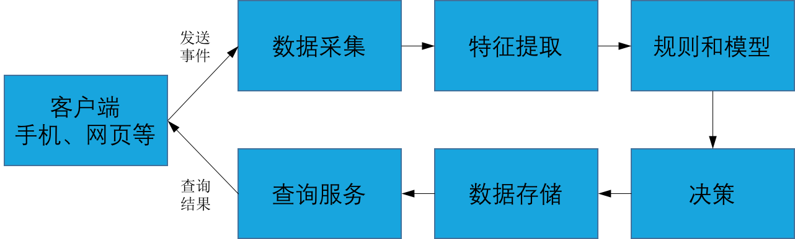

## 风控系统简介

金融风控分析的风险有两类：一类是贷款对象信用风险，另一类是贷款对象欺诈风险。
两类风险使用的风控因素和模型都有区别。

贷款对象信用风险，关注的是贷款对象自身的信用状况、还款意愿和还款能力。
信用风险评估常用的分析因素有四要素认证和征信报告，使用的风控模型主要是可解释性强的逻辑回归评分卡。

贷款对象欺诈风险，关注的则是贷款对象是不是在骗贷。在欺诈情形下，贷款对象可能提供的所有征信信息都是正常的，
但是这些信息是通过伪造或黑产渠道而来，以大量具有良好信用的不同身份获得贷款后，欺诈成功，卷款而逃。
欺诈风险使用的分析因素多种多样。
比如，网络因素如IP是否集中，用户属性因素如年龄和职业，用户行为因素如是否在某个时间段集中贷款，
社会信用因素如社保缴纳情况，第三方征信如芝麻信用得分，还有各种渠道而来的黑名单等。
总体而言，欺诈风险评估使用的因素来源更多，使用的模型也更加多样，比如决策树、聚类分析等。

金融风控的一般流程如下。在手机或网页等客户端，用户在发出注册、贷款申请等事件时，
客户端将用户属性、行为、生物识别、终端设备信息、网络状况、TCP/IP协议栈等信息发送到数据采集服务器。
数据采集服务器收到数据后，进行字段提取和转化，发送给特征提取模块。
特征提取模块按照预先设定的特征清单进行特征提取，然后以提取出来的特征清单，作为模型或规则系统的输入。
最终依据模型或规则系统的评估结果作出决策。

根据上面描述的业务流程，完整的风控系统架构设计如下。

图2.1金融风控系统

### 总结
本节简单介绍了金融风控的业务流程和系统架构，
主要是为了让读者对实时流计算系统的应用有一个真实和具体的认识，以避免雾里看花水中望月。
后续章节将参照该系统，逐一展开对实时流计算系统各部分的讨论。
