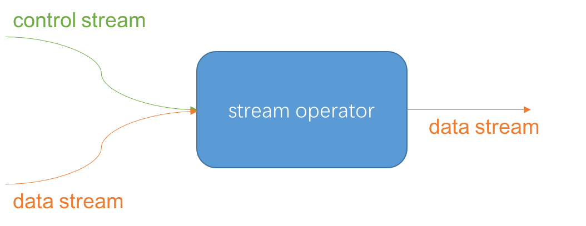
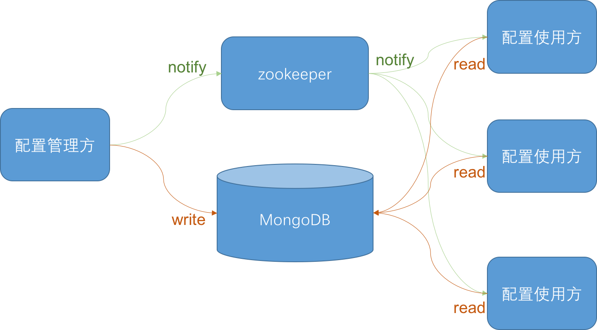

## 动态配置
当将配置从代码中抽离出来的那刻起，它就是给人修改的。
那从何谈起配置的静态和动态之分呢？
这里我们做个简单的划分，如果配置在程序启动后不再需要修改，那它就属于静态配置。
而如果程序启动后，配置还会因为某些原因发生变更并重新生效，那它属于动态配置。

静态配置在程序启动前确定，在程序启动后就不再变化了。
比如程序使用的内存大小、数据库连接等配置，在开发、测试、生产环境下各不相同。
这些配置由构建或部署工具管理，比如saltstack的pillar文件。
静态配置由于其在程序启动后不变的特点，管理起来相对更简单，一般使用运维工具配合版本控制器即可。
比如使用saltstack运维技术栈，配置git就可以很好地实现静态配置的管理。

动态配置则在程序运行过程中，可以发生变更并重新生效。比如调整日志的级别、更改决策规则等等。
动态配置因为牵涉到改变程序在运行时的行为，因此相比静态配置会复杂很多。
主要体现在以下方面。
* 分布式系统环境
分布式环境下，一个配置可能会被多个服务、多个实例来使用。配置的变更如何通知到具体相关服务和实例？
不同的服务和实例刷新配置的时间也可能并不一致。如果需要刷新的实例很多，系统在配置变更后什么时候能够稳定下来？
在配置不稳定的过程中，业务流程的执行会有什么影响？
* 安全性
动态配置修改因为改变了程序的运行时行为，有可能导致程序运行发生错误。如果真发生运行错误了，该怎样处理？
如果回滚配置，也可能因为程序运行发生致命错误，导致回滚失败，又该怎样处理？
* 版本控制
动态配置时常在变化。如果线上客户发现配置变化后有问题需要回溯，怎样跟踪配置的变更历史？
* 监控
由于动态配置在变更时，可能引起各种各样的问题，比如前面说的安全性、程序重新稳定等问题。
这些问题可能发生的概率不大，但是如果它们真的发生，实际上解决起来是比较棘手的。
比如动态配置下发成功，到底是服务实例收到新配置就算成功，还是服务实例收到新配置后运行成功才算成功？
即使当时运行成功了，错误也可能是在运行一段时间后才出现。针对这一些列问题，即使是实现了分布式事务，也是无济于事的了。
有鉴于以上原因，对各个服务实例上当前使用的配置进行监控和检查，也是非常重要的事情。
当然，虽然这样考虑，但是必须强调的是，动态配置系统的责任边界必须限定在相关服务实例正确接收到更新后的配置即可，而不能扩散太多。
否则就真的出现上面说的，到底程序什么时候运行错误这种没完没了的问题了。

### 动态配置的实现
#### 控制流方式
在通信领域，除用于数据传输的数据通道外，通常还会有一条用于传输控制信令的控制通道。
在流计算领域，我们可以借鉴这种思路。在数据流之外，我们可以新增一条控制流。
通过控制流与数据流的关联（union或join）操作，就可以将控制信息作用到数据流上。
而流本身又是动态的，所以通过控制流的方式来实现动态配置是一种水到渠成的方法。

下面是通过控制流来实现动态配置的示意图。

<div align="center">

<div style="text-align: center; font-size:50%">img10.2.控制流与数据流关系</div>
</div>


下面我们来演示下Flink中实现控制流对数据流的控制。

```
public static void testControlStream() throws Exception {
    StreamExecutionEnvironment env =
            StreamExecutionEnvironment.getExecutionEnvironment().setParallelism(3);

    List<Tuple1<String>> controlData = new ArrayList<>();
    controlData.add(new Tuple1<>("BLUE"));
    controlData.add(new Tuple1<>("YELLOW"));
    DataStream<Tuple1<String>> controlStream = env.fromCollection(controlData);

    List<Tuple1<String>> dataStreamData = new ArrayList<>();
    for (int i = 0; i < 1000; i++) {
        dataStreamData.add(new Tuple1<>("BLUE"));
        dataStreamData.add(new Tuple1<>("YELLOW"));
        dataStreamData.add(new Tuple1<>("WHITE"));
        dataStreamData.add(new Tuple1<>("RED"));
        dataStreamData.add(new Tuple1<>("BLUE"));
        dataStreamData.add(new Tuple1<>("YELLOW"));
        dataStreamData.add(new Tuple1<>("RED"));
    }

    DataStream<Tuple1<String>> dataStream =
            env.fromCollection(dataStreamData).keyBy(0);

    DataStream<String> result = controlStream
            .broadcast()
            .connect(dataStream)
            .flatMap(new ColorCoFlatMap());
    result.print();
    env.execute();
}

private static final class ColorCoFlatMap
        implements CoFlatMapFunction<Tuple1<String>, Tuple1<String>, String> {
    HashSet blacklist = new HashSet();

    @Override
    public void flatMap1(Tuple1<String> control_value, Collector<String> out) {
        blacklist.add(control_value);
    }

    @Override
    public void flatMap2(Tuple1<String> data_value, Collector<String> out) {
        if (blacklist.contains(data_value)) {
            out.collect("invalid color " + data_value);
        } else {
            out.collect("valid color " + data_value);
        }
    }
}
```

在testControlStream函数里，创建了两个流，即控制流controlStream和数据流dataStream，
然后将controlStream广播（broadcast）后与dataStream连接（connect）起来。
在ColorCoFlatMap中，如果接收到的是控制事件，就保存到黑名单里面。
如果是颜色事件，就检查其是否在黑名单里面。
这样，通过控制流动态配置黑名单清单，而数据流使用这个黑名单清单，
所以我们通过控制流的方式对数据流行为进行的动态配置。

另外在Flink中，为了方便动态配置实现，还引入可以直接使用的广播状态（Broadcast State）。
广播状态的使用方式与broadcast类似，这里就不再展开了。


#### 共享存储方式
共享存储是另外一种实现动态配置的方法。
将配置存放在共享数据库中，当配置有变更时，先将配置写入共享数据库，
然后通过配置使用方轮询或者通知配置使用方配置变更的方式，
配置使用方即可以重新读取更新后的配置。

下面就是用MongoDB结合zookeeper来实现动态配置的方案。

<div align="center">

<div style="text-align: center; font-size:50%">img10.3.共享存储实现动态配置</div>
</div>

在上面的解决方案中，当配置管理方需要修改配置时，
首先将配置写入到MongoDB里，然后变更zookeeper的某个节点。
当配置使用方监听到zookeeper中这个节点变更时，
就知道配置已经发生变更，从而从MongoDB里重新读取新的配置。
这样，就完成了动态配置的功能。

由于zookeeper本身具备存储数据的能力，
如果配置很简单，可以直接使用zookeeper存储即可。
但是，在复杂的业务场景下，可能配置也非常复杂，并具有丰富的层次组织结构。
这种情况下还是尽量将配置本身从zookeeer中剥离处理，存储到单独的数据库中，比如MongoDB或MySQL。
zookeeper只用于全局配置变更时的协调。毕竟，zookeeper的设计目的是做分布式协调，而不是一个文件系统。
