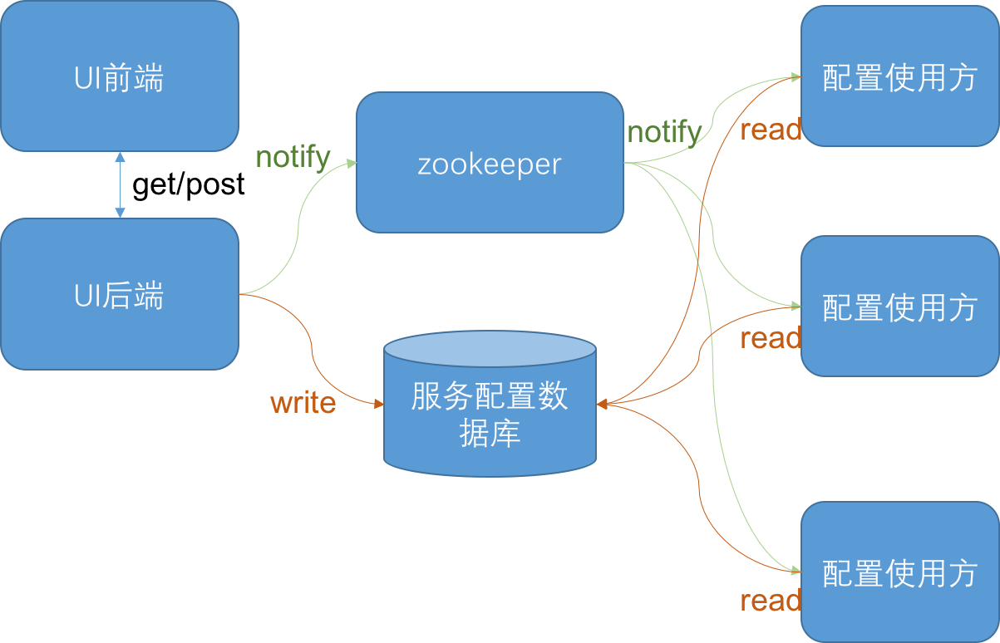
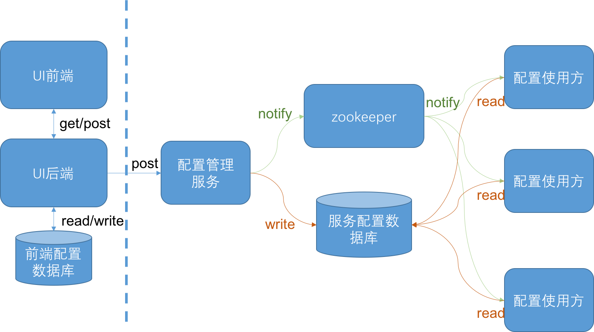

## 将前端配置与后端服务配置隔离开

在动态配置的使用场景中，有一类是由用户在UI上修改配置。
针对这种用户修改配置，然后后端服务配置生效的需求。
很容易产生下面的设计方案。

img10.4.前后端配置不分离

在上面的设计方案中，当UI前端修改配置后，配置变更消息发送到UI后端，
然后UI后端直接修改服务配置，使服务配置生效。

这种设计方案简单明了，实现也很简单。但是这种方案在许多场景下，存在些很微妙的问题。
考虑以下这些情况：

* 用户在界面上，需要修改A、B和C三个配置项。
但是，只有当这三个配置同时修改好后，才能使其生效。

* 用户在界面上修改了一个模型，但是他并不像让这个模型立刻生效，而是想保存下来
过一段时间再使用。

* 用户修改了配置，但是配置尚未生效，用户想将配置保存下来，以免修改丢失，下次修改时又得重填。

真实的场景下，用户操作UI，更改配置的方式千变万化，或许只有我们想不到，没有他们做不到。

这种将前端用户行为与后端服务配置变更直接耦合起来的解决方案，
使得我们在面对这些真实场景下的问题时，变得束手束脚，非常尴尬。

那我们应该怎样避免这种问题呢？很简单，就是将前端用户的配置行为和后端服务的配置隔离开。
下面是这种设计方案的架构图。

img10.5.前后端配置分离

在上面的解决方案种，给UI后端单独配备了一个数据库。
所有与用户行为相关的中间配置信息都存储在这个配置里面。
当用户在UI上修改配置时，配置的变化都只体现在这个数据库里。
只有当用户在UI上点击"生效"按钮时，再由UI后端取出应该生效的配置信息，
然后调用配置管理服务提供的接口。配置管理服务在接收到配置变更请求后，
对配置进行解析，生成配置使用方能够识别的格式，然后写入服务配置数据库，
并通知配置使用方更新配置。

通过上面这种将前段配置和后端服务配置隔离的设计方案，
我们可以给予前端UI设计充分的发挥空间，同时也使整个系统配置状态完整统一，服务运行更加安全。

