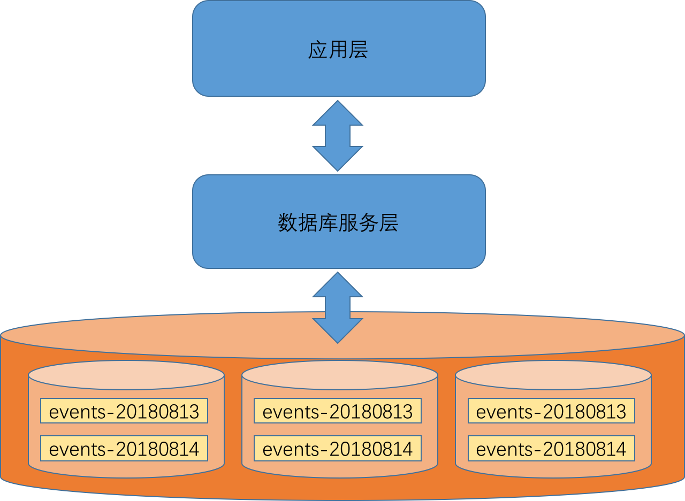

## 点查询

点查询是指通过给定主键值或索引值来查询数据库中某条记录的过程。点查询每次最多返回一条记录。

在实时流计算的场景中，点查询主要用于计算结果的查询。
当实时流计算系统在完成每个事件的分析后，需要将结果保存下来，以供后续的查询和使用。
这种查询是针对给定主体获取其各种属性的过程，因此只需要使用到代表主体的主键或索引。
比如通过事件id来查询某个事件的异常指数，通过用户id来查询用户的信用得分，
通过设备id来查询设备的风险指数等等。
其中，异常指数、信用得分、风险指数都是实时流计算的输出结果。在业务系统做决策时，需要以这些结果作为参考依据。

针对点查询的数据库选择是比较丰富的。
比如传统的关系型数据库如MySQL、以NoSQL新贵出身的MongoDB等，都很适合存储此类数据。

但即便如此，还是需要注意几个问题。

### 数据灵活性
数据的灵活性在于当数据的结构或字段变更时，是否需要大幅度地修改原有数据库表定义。
在关系型数据库中，表定义和表之间的依赖关系构成了结构化查询的基础。
明确的表定义和表之间的依赖关系，使得数据有一个清晰完整的视图。
但与之而来的问题是失去了数据的灵活性。
比如说，在实时流计算分析中，有些计算结果是动态字段。换言之，这些字段在分析结果中，可能有，也可能没有。
比如针对IP的异常度分析，结果是放在ip.anomaly字段中，
而针对用户自定义字段cst_f1字段的异常度分析，结果是放在cst_f1.anomaly字段中。
如果用关系型数据库的方式来构建这种数据关系，会让表定义和表依赖变得十分复杂，不便于程序设计。
另外，即使我们设计出了这套复杂的表组织结构，当数据在结构变化和字段变更时，又不得不修改表定义。
如果在程序中还使用了ORM框架，那对应的实体类也需要修改，这部分的变更也会变得冗杂和繁琐。

因此，在实时流计算系统里，更加倾向于用NoSQL来存储计算的结果。更加具体地说，是文档数据库。

#### MongoDB
MongoDB是一种文档数据库。在MongoDB中，不需要为存储的数据指定明确的格式定义（schema）。
MongoDB中的一个文档对应着传统关系数据库中的一条记录，但是文档是JSON格式的。
通常，我们把具有相同数据结构的文档放在同一个MongoDB集合中。
MongoDB集合的概念类似于关系数据库中的表，不过我们在使用集合时，无需提前创建它即可以使用。

### 数据过期和按时间分表
对于一个用于在线实时查询的数据库而言，数据过期的问题非常重要。
甚至可以说，如果没有考虑数据过期的问题，那这个系统就不应该上线。
这是因为，在实时流计算系统中，新的分析结果不断地写入数据库。随着时间流逝，数据库里的数据会越来越多。
如果不考虑数据过期淘汰，一段时间后数据库被撑满，查询效率降低，导致系统不可用。
在MongoDB中，这个问题尤其明显。MongoDB在实际使用中是比较消耗内存和IO资源的，当MongoDB中的数据量很大时，
如果不小心做了包含全表扫描（即使是使用了索引）过程的查询，MongoDB都会出现查询缓慢甚至卡顿的问题。

因此，我们需要严格地控制数据库中每个数据组的数据量。在MongoDB中，就是要严格控制每个集合的数据量。
这样做，其实有三种非常重要的意义。
其一，严格控制每个表的数据量，可以保证在这个表上的查询都是可以即时返回的，不会出现一个全表查询堵死其它所有查询的情况。
其二，在实时查询系统里，数据的有效性本身就是有时间范围的。
比如我们提取的"过去一天同一设备上登录的不同用户数"这种特征，在一天之后，其实就没有意义了。
其三，某些对数据的查询本身就具有时间上的局部连续性。比如经过实时流计算系统分析后的事件，
被存放在MongoDB后，在接下来的几秒钟内就会被决策系统查询访问，之后决策系统也不会再查询这个事件了。

所以，在实时系统里，针对点查询选择的数据库，我们一定要考虑好数据过期淘汰的方案。
对于支持TTL的数据库来说，可以方便地设置每条记录的过期时间，这样对于数据写入和查询也非常方便，与没有TTL时并无太大区别。

而对于不支持TTL的数据库来说，可以使用按时间分表的方式来存储数据。
比如每天的数据存储在一张MongoDB集合里，然后用定时任务定期地删除过期的表。

虽然使用数据库自带TTL支持的方案，对于开发而言非常方便。
但是笔者还是认为使用按时间分表，自己来维护数据过期淘汰的方案会更好些。
因为这样做有如下优点：
其一，每张表的数据量完全可控，维持在一个较小的范围内，可以稳定地控制每次请求响应的速度。
其二，每张表代表了一个时间段的数据，当出了问题需要复盘，或者需要查找问题时，非常容易确定问题数据所在。
其三，当数据结构变更时，可以明确地限定变更时间。因为旧时间段的数据和新时间段的数据是完全隔离开的，不会出现冲突的问题。
可以逐表逐表地迁移数据，而不会出现一个遍历查询卡住其它所有线上查询的情况。

当然这样做也有几个缺点：
其一，如果不知道点查询对象的时间段，就需要依次查询所有表。对于这点，可以通过在查询时带上一个时间戳参数的方案来避免。
通过这个时间戳，可以提示（hint）要查询的数据大概在哪个时间段，从而缩小查找的范围。
其二，如果查询的目标在多个时间段内，就需要对多次查询结果再做一次合并。
对于这个问题，本身不会出现在点查询这种情形下，因为点查询最多只返回一个结果。
但是对于在问题复盘或分析问题时，如果需要做这种跨表查询，就需要分析人员自行写脚本来帮助分析了。

其实，针对以上这些缺点，其实也提示我们在做这种实时查询数据库时，可以添加一层数据库服务层。
在数据库服务层中，封装好内部所有的分表等复杂性，对外提供REST或RPC的接口，从而简化业务层程序的开发。

img9.1.数据库服务

