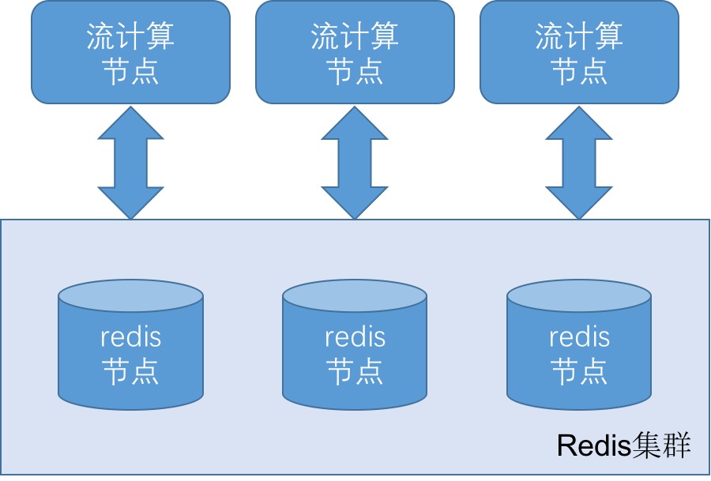
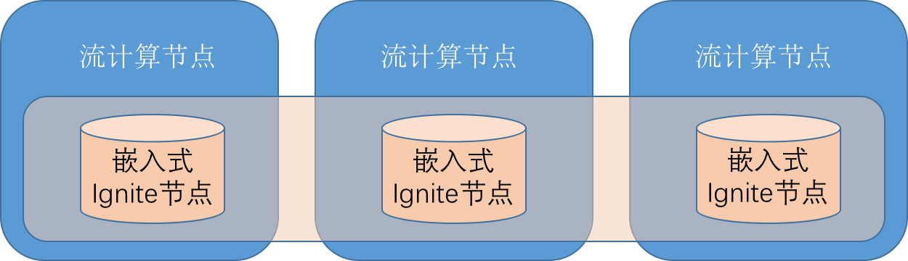
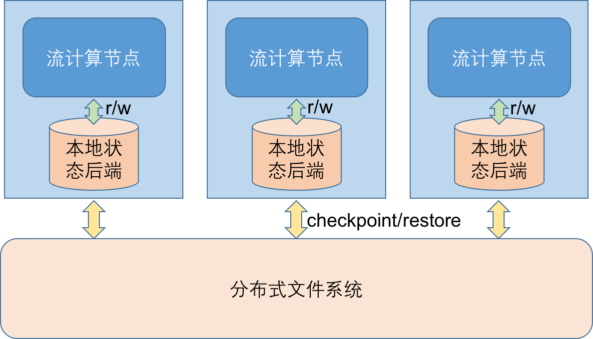

# 扩展为集群

随着业务增长，数据量越来越大，单一机器逐渐不能满足与日剧增的数据量。
与此同时，数据量变大后程序的性能也开始变得越来越差以至于最后不可接受。
我们必需未雨绸缪，让流计算系统能够伴随业务不断成长。
将流计算系统从单节点扩展为集群，能够不断对计算资源和计算能力进行水平扩展。

当状态管理从单节点扩展为分布式的集群时，又该如何设计和实现呢？下面我们就来探讨下这个问题。

## 基于Redis的状态集群
首先我们来看下Redis集群在状态管理中的实现架构。

<div align="center">

<div style="text-align: center; font-size:50%">图6.1 redis集群</div>
</div>

当采用Redis集群来实现状态管理时，流计算集群和Redis集群节点是分离开的。
流计算集群中的每个节点都可以任意访问Redis集群中的任何一个节点。
这样的架构有个非常明显的好处，就是计算和数据是分离开的。
我们在任何时候，可以任意地新增流计算节点，而不必影响Redis集群。
反过来，我们也可以任意地新增Redis节点，而不必影响流计算集群。

但是这样的体系结构也有缺点。
考虑某次特征计算使用到的状态是分散在多个Redis集群中的情况，那么这次特征计算就要访问多个Redis节点。
这会带来两方面的问题，一方面多次地访问Redis节点，会带来多次的网络IO操作，对性能造成极大影响；
另一方面，访问不同位置的数据，违反了所谓的"局部性原理"，这不仅会极大地影响程序性能，
还让我们失去了针对数据局部性改进程序、提升性能的空间。

在前面使用Redis实现特征计算的时候，我们实现过"过去一天同一用户的总交易金额"这样一个特征。
在实现过程中，我们将`1天`分成了24个`1小时`的子窗口，因此在查询计算时，有24次的redis get操作。
假设这24个子窗口的状态数据是分散在6台Redis上的。
如果不做任何优化设计，那么这一个特征计算，就需要24次IO操作，而且要牵涉到与6台不同服务器的远程通信，
这势必对性能造成极大的影响。针对这种问题我们应该怎样做优化呢？

### 局部性原理
局部性原理是指计算单元在访问存储单元时，所访问的存储单元应该趋向于聚集在一个局部的连续区域内。
利用局部性原理可以更加充分地提高计算资源的使用效率，从而提高程序的性能。

前面讲到在"过去一天同一用户的总交易金额"这个特征计算中，我们可能需要访问6台Redis节点上的数据。
这是因为默认情况下，Redis Cluster将数据按照key做hash后分散各个slot里，而slot又是分布在各个Redis节点上。
如果我们能够让"同一用户"的状态数据保存在相同的slot里，就可以让这批数据存在于相同的redis节点上。
正好，redis cluster为我们提供了贴心的`tag`功能，允许只使用key中的部分字段来计算hash值。
具体而言就是，如果`hash_tag`指定为`{}`，那么当key中含有`{}`的时候，就不使用整个key来计算hash值，
而只对`{}`包括的部分字段计算hash值。
比如在使用`tag`后，每个小窗口内记录这个窗口交易总金额的key如下所示:

```
$event_type.{$userid}.$window_unit.$window_index
```
经过`tag`化后，相同用户的状态数据就落在相同的redis节点上。这样，我们只需要访问一个redis节点了。

现在数据放在同一个节点上了，那这有什么好处呢？好处多着呢。
首先，我们可以放心大胆地使用Redis的各种多键指令了，比如`MGET`、`MSET`、`SUNION`和`SUNIONSTORE`等等。
这些指令在操作过程中可以一次访问多个键，从而提高指令执行效率。
而如果这些key不在同一个Redis节点上，这些指令是不能使用的。
其次，我们可以充分发挥redis的pipeline功能了。通过Redis的Pipeline功能，
可以一次性发送多条指令，这些指令间可以没有任何依赖关系。当执行完后，这些指令的结果一次性返回。
通过这种批次传递和执行指令的方式，redis减少了平均每条指令执行时不必要的网络开销，提升了执行效率。
同样的，如果这些数据不在同一个redis节点上，我们就不能够使用pipeline的功能了。
所以说，将相关数据放在相同的节点上，给我们留下更多的优化空间。
经过上述的优化设计后，原本需要24次IO操作的特征计算，最优情况下降低为只需要一次IO操作。
这就是局部性原理的威力所在。

当然，使用局部性也可能出现数据在集群节点上分布不均匀的问题。
所以在选择分区`tag`时，应该尽量分得更细更均匀些，这样可以减小数据倾斜的问题。

### 批次请求处理
批次请求处理是指将多个请求收集起来后，一次性成批处理的过程。
批次请求处理可以降低均摊在每条消息处理时，非有效用于消息处理的资源和时间。
Redis的Pipeline功能就是一种批次请求处理的技术。但是我们不能仅限于Redis的Pipeline功能。
实际上，任何与IO相关的操作都可以借鉴这种批次处理的思想。
比如RPC（远程过程调用）、REST请求、数据库查询等等。
在实际开发过程中，将请求做批次化处理本身并不是非常复杂过程，
比较麻烦的是应该怎样将分布在程序中各个地方的请求收集起来。
针对这个问题，我们可以使用队列和CompletableFuture的异步方案。
当请求发起时，将请求提交给队列后获取一个CompletableFuture对象。
而另外一个线程，等着从这个队列中取出请求。当该线程取出的请求达到一定数量或者等待超过一定时间时，
将取出的这批请求封装成批次请求，发送给请求处理服务器。当批次请求返回后，将批次结果拆解开，
再依次使用CompletableFuture的complete函数将结果交给各个请求发起者。
这样就实现了请求的批次化处理。

批次化处理的好处在于提高了请求处理的吞吐量，降低了每条请求平均响应时延。
但是因为使用了队列和异步的方案，也有可能会提高特定某条请求的响应时延。
因此在实际开发中，读者需要综合考虑自己的场景，选择最合适的方案。


## 基于Ignite的状态集群
我们再看下Ignite集群用于状态管理的架构。

<div align="center">

<div style="text-align: center; font-size:50%">图6.2 Ignite集群</div>
</div>

从上面的架构图我们可以看出，当采用Ignite来实现状态管理时，
计算节点和数据节点是耦合在一起的，它们在相同的JVM内运行。
每个Ignite节点会保存全部集群数据中的一部分，
流计算节点通过其嵌入的Ignite节点来访问状态数据。
而Ignite数据格点的工作机制，允许计算尽可能只需访问本地节点上的数据，减少数据在网络间的流动。
这种设计方案充分利用了Ignite提供的数据格点能力，是一种典型的网格计算架构。

采用Ignite数据格点的方案，可以让我们不必过多考虑数据分区问题。
Ignite会自行处理数据局部性以及计算和数据亲和性的问题。
Ignite提供的各种计算和查询接口，屏蔽了分布式数据和分布式计算的复杂性，为我们开发分布式系统带来极大的便利性。
网格计算中所有节点都是平等的，当需要水平扩展集群时，只需要将新的节点添加到网格中即可。

不过这种使用数据网格的方案，成功的地方也是它失败的地方。将计算节点和数据节点耦合在同一个JVM后，
增加了单一节点的复杂性，同时也使计算资源的分配、管理和监控等变得更加复杂。
这点需要读者在做方案选型时根据具体场景和需求自行定夺。

## 基于分布式文件系统的状态管理集群
除了上面两种状态管理的集群外，还有一种基于分布式文件系统的状态管理集群。
这也是一种非常典型的分布式状态管理方案。Flink的状态管理使用的就是这种方案。

<div align="center">

<div style="text-align: center; font-size:50%">图6.3 Flink状态管理</div>
</div>

在上面的这种分布式状态管理方案中，流计算节点针对状态的操作完全在本地完成，不涉及到任何远程操作。
但如果只是这样，那当需要扩展或收缩集群的节点数时，怎么保证能够读取到原来的状态信息呢？
因此在每个节点上，有专门的线程定期或在必要的时候（比如任务关闭前），对状态进行checkpoint。
所谓checkpoint，是指将本地状态后端里的数据做快照(snapshot)之后，保存到分布式文件系统里的过程。
当集群在节点数变化后再重启时，各个节点首先从分布式文件系统中读取其所负责数据分片所在的快照，
再将快照恢复到状态后端里，这样各个节点就获得重启前的状态数据了，之后的计算又可以完全在本地完成。

这种方案的优势在于，流计算节点对状态的操作在本地完成，不需要任何远程操作。
这样本地状态后端的选择可以非常丰富，给性能优化留下极大空间。
比如Flink目前就已经支持内存、文件系统和RockDB三种状态后端。

不过这种方案也有个缺点，就是不能在运行时动态扩展或缩小集群。当集群节点数变更时，需要重启集群。
对应在Flink里，就是当需要改变算子的并行度（operator parallelism）时，必需重启作业。

## 总结
本节讲解了状态管理从单节点扩展为集群时的三种方案。这三种方案代表了三种不同的分布式数据管理思路。
每种方案都有自己的优缺点，当我们在做方案选型时，需要根据具体的使用场景选择最合适的方案。


