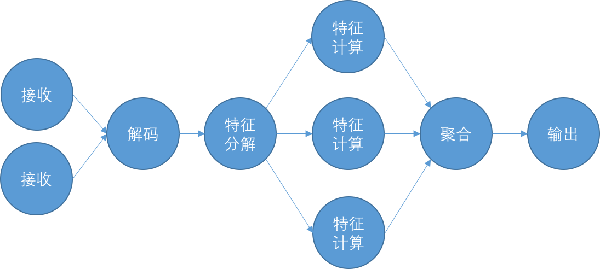

## 造一个流计算框架轮子

在金融风控中，我们很重要的一个目标是判断贷款对象的信用风险或欺诈风险。
信用风险或欺诈风险的计算通常会使用到评分卡或各种模型，其中模型又包括统计模型和机器学习模型。
不管是评分卡还是模型，它们的输入都是各种特征。因此，在进行风险判断前，我们需要进行特征提取。
特征提取是指从我们采集的数据中，提取出模型所需要使用的特征的过程。
具体需要提取哪些特征是数据分析和建模的工作，这个超出本书范围，不做讨论。

下面我们就用流的方式来实现特征提取模块。通常使用DAG（有向无环图）来描述流的执行过程。比如下面就是个DAG。

在上面的DAG中，每个节点表示一个计算步骤或计算单元实例，每个边表示数据在步骤间的流动或在计算单元间的流动。
这其中有两层含义：

1. 如果不考虑并行度，那么每个节点表示的是计算步骤，每条边表示的是数据在计算步骤间的流动。
2. 如果考虑并行度，那么每个节点表示的是计算单元，每条边表示的是数据在计算单元间的流动。

我们要实现的特征提取模块，首先从kafka拉取经过ECT后的原始数据，然后解码为json对象，
再进行特征提取，最后发送到kafka中去。在金融风控场景下，一个事件通常需要提取数十个甚至数百个特征，
如果采用串行逐个计算每个特征的方式，必然导致每个事件的处理时延较大。
为了降低事件处理时延，我们需要将特征计算设计成并发的方式。
也就是说，同时计算所有不同的特征，然后将这些特征汇总起来，就完成了一个事件的所有特征计算。
根据上面的流程，我们可以设计特征提取模块的DAG如下。

<div align="center">
<div style="text-align: center; font-size:50%">图3.2 特征提取DAG</div>

</div>

在上面的图中，接收节点从kafka拉取事件，然后发送给解码节点。
解码节点将事件解码为json对象，并交由特征分解节点。在将事件需要提取的特征分解后，分发给特征计算节点。
特征计算完后，再将所有特征计算结果合并，最后将提取了特征的事件发送到kafka中去。

为了让读者对流计算的认识更深刻，我们就先从头开始造一个流计算的"轮子"，并用这个轮子来实现上面特征提取模块的DAG流程。

### 造流计算轮子
对照着特征提取模块的DAG图，我们很容易地想到，图中的每个节点是一个完成特定功能的计算单元，
不妨将每个节点抽象为一个服务类Service。在节点之间，用有向边来描述节点间的事件传递，
因此很容易地想到用队列Queue来作为Service之间事件传递的载体。
比较难实现的是特征分解计算后再聚合的步骤，这里我们对问题稍微做些转化，
即借用Future这个类来实现这种类似于map-reduce的计算模式。

我们先来实现服务类Service。

```
public abstract class AbstractPipeService<I, O> implements IService {
    // ......

    private boolean pipe(boolean checkStop, boolean exitWhenNoInput) throws Exception {
            // ......
            List<I> inputs = poll(inputPipes);
            List<O> outputs = process(inputs);
            offer(outputPipes, outputs)
            // ......
    }

    @Override
    public void start() {
        thread = new Thread(() -> {
            try {
                beforeStart();

                while (!stopped) {
                    try {
                        if (pipe(true, false)) {
                            break;
                        }
                    } catch (Exception e) {
                        logger.error("unexpected exception", e);
                    }
                }

                beforeShutdown();

            } catch (Exception e) {
                logger.error("unexpected exception", e);
            }
        });
        thread.setName(getName());
        thread.start();
    }
}

public abstract class SimplePipeService<I, O> extends AbstractPipeService<I, O> {
    // ......

    @Override
    protected List<I> poll(List<Pipe<I>> inputQueues) throws Exception {
        inputsList.clear();
        Pipe<I> inputPipe = inputQueues.get(0);

        I event = inputPipe.poll(inputTimeout, TimeUnit.MILLISECONDS);
        if (event != null) {
            inputsList.add(event);
            return inputsList;
        } else {
            return null;
        }
    }

    @Override
    protected boolean offer(List<Pipe<O>> outputQueues, List<O> outputs) throws Exception {
        Pipe<O> outputQueue = outputQueues.get(0);
        O event = outputs.get(0);
        return outputQueue.offer(event, outputTimeout, TimeUnit.MILLISECONDS);
    }
}
```

在上面的代码中，我们定义了一个抽象类`AbstractPipeService`和它的一个子类`AbstractPipeService`。
它们的功能是从其输入队列`inputPipes`中拉取`poll`消息，经过处理`process`后，再发送到下游的输入队列`outputPipes`中去。

在实现服务类的时候，我们还定义了消息传递的载体`Pipe`接口，以及它的实现类`ArrayBlockingQueuePipe`。

```
public interface Pipe<E> {
    E poll(long timeout, TimeUnit unit) throws InterruptedException;
    boolean offer(E e, long timeout, TimeUnit unit) throws InterruptedException;
}

public class ArrayBlockingQueuePipe<E> extends ArrayBlockingQueue<E> implements Pipe<E>{
    public ArrayBlockingQueuePipe(int capacity) {
        super(capacity);
    }
}
```

可以看出，我们实现的`ArrayBlockingQueuePipe`是基于`ArrayBlockingQueue`的，
也就是说，它的容量是有限的，而且是一个阻塞队列。这就有助于实现在前面的章节中谈到过的反向压力功能。


### 实现特征提取DAG节点
现在我们已经实现了节点和节点之间消息传递的通道。接下来，我们就用它们来实现特征提取的DAG。
按照图3.2的DAG，我们用代码来"画"出这个DAG拓扑图。

首先来实现Receiver节点。Receiver的功能是从kafka拉取数据。

```
public class Receiver extends SimplePipeService<byte[], byte[]> {
    // ......

    @Override
    protected List<byte[]> poll(List<Pipe<byte[]>> inputQueues) throws Exception {
        if (stopped) return null;

        inputsList.clear();
        if (kafkaReceiver.hasNext()) {
            byte[] event = kafkaReceiver.next();

            inputsList.add(event);
            return inputsList;
        } else {
            return null;
        }
    }
}
```
在上面的实现中，`Receiver`的poll方法在kafka中有数据可读时，就将其读取出来，并发送到其输出队列（也就是其下游的输入队列）中。

再来看Decoder节点。Decoder节点的功能是将从kafka中读取的数据解码为一个json对象。

```
public class Decoder extends SimplePipeService<byte[], JSONObject> {
    // ......

    @Override
    protected List<JSONObject> process(List<byte[]> inputs) throws Exception {
        byte[] event = inputs.get(0);
        JSONObject eventJson = JSONObject.parseObject(new String(event, Charsets.UTF_8));
        outputsList.clear();
        outputsList.add(eventJson);
        return outputsList;
    }
}
```
在`Decoder`的实现中，process方法从其输入队列中读取byte[]类型的消息后，解析为json对象，然后发送到其输出队列。

数据解析为json对象后，就可以进行特征提取了。在前面的章节中我们已经提到，为了减小特征提取的时延，
我们需要让所有特征的计算并行起来。因此在FeatureJoiner节点中，我们将特征提取进行了分解。

```
public class FeatureForker extends SimplePipeService<JSONObject, EventFutureWrapper> {

    private JSONObject doFeatureExtract(JSONObject event, String feature) {
        // TODO: extract feature of event
        JSONObject result = new JSONObject();
        result.put(feature, feature);
        return result;
    }

    private class ExtractorRunnable implements Runnable {
        @Override
        public void run() {
            try {
                JSONObject result = doFeatureExtract(event, feature);
                future.set(result);
            } catch (Exception e) {
                logger.error("exception caught", e);
                future.set(null);
            }
        }
    }

    private List<SettableFuture<JSONObject>> fork(final JSONObject event) {
        List<SettableFuture<JSONObject>> futures = new ArrayList<>();
        final String[] features = {"feature1", "feature2", "feature3"};
        for (String feature : features) {
            SettableFuture<JSONObject> future = SettableFuture.create();
            executorService.execute(new ExtractorRunnable(event, feature, future));
            futures.add(future);
        }
        return futures;
    }

    @Override
    protected List<EventFutureWrapper> process(List<JSONObject> inputs) throws Exception {
        List<SettableFuture<JSONObject>> featuresFutures = fork(event);
        ListenableFuture<List<JSONObject>> resultFuture = Futures.allAsList(featuresFutures);
        EventFutureWrapper result = new EventFutureWrapper(event, resultFuture);
        outputsList.clear();
        outputsList.add(result);
        return outputsList;
    }
}
```
在`FeatureJoiner`的process方法中，使用fork方法将事件需要提取的特征分解为多个ExtractorRunnable，
并提交给专门进行特征提取的ExecutorService执行。
执行的结果用一个List<SettableFuture<JSONObject>>对象来表示，
然后通过Futures.allAsList将这些SettableFuture对象封装为一个包含了所有特征计算结果的ListenableFuture<List<JSONObject>>对象。
至此也就完成了特征的分解和并发执行，并且我们得到了一个用于将来获取所有特征计算结果的ListenableFuture对象。


FeatureJoiner节点的功能则是将所有并发执行后的特征计算结果合并起来。

```
public class FeatureJoiner extends SimplePipeService<EventFutureWrapper, JSONObject> {
    // ......

    @Override
    protected List<JSONObject> process(List<EventFutureWrapper> inputs) throws Exception {
        EventFutureWrapper eventFutureWrapper = inputs.get(0);
        Future<List<JSONObject>> future = eventFutureWrapper.getFuture();

        JSONObject event = eventFutureWrapper.getEvent();
        try {
            List<JSONObject> features = future.get(extractTimeout, TimeUnit.MILLISECONDS);
            JSONObject featureJson = new JSONObject();
            for (JSONObject feature : features) {
                if (feature != null) {
                    featureJson.putAll(feature);
                }
            }
            event.put("features", featureJson);
        } catch (TimeoutException e) {
            logger.error(String.format("feature extract timeout[%d]", extractTimeout));
            future.cancel(true);
            event.put("features", new JSONObject());
        }

        outputsList.clear();
        outputsList.add(event);
        return outputsList;
    }
}
```
由于在`FeatureForker`中，我们已经将所有特征计算的结果用ListenableFuture<List<JSONObject>>封装起来，
故而在`FeatureJoiner`的process方法中，用future.get()即可获取所有特征计算结果。
而且为了保证能够在一定的时间内结束对这条消息的处理，还指定了timeout时间extractTimeout。
当收集了所有的特征后，将其添加到消息json对象的features字段。

最后，就是由Sender节点将提取了特征的消息再发送到kafka去，由下游的规则和模型模块使用。

```
public class Sender extends SimplePipeService<JSONObject, JSONObject> {
    // ......
    @Override
    protected boolean offer(List<Pipe<JSONObject>> outputQueues, List<JSONObject> outputs) throws Exception {
        JSONObject event = outputs.get(0);
        kafkaSender.send(topic, event.toString().getBytes(Charset.forName("UTF-8")));
        return true;
    }
}
```
至此，特征提取DAG的各个节点均已实现。接下来需要将这些节点整合起来，形成完整的DAG。

### 实现特征提取DAG拓扑
虽然已经实现了所有的节点，但是只有用管道把这些节点联通起来，才能实现完整的特征提取DAG。具体实现如下。

```
List<IService> services = new ArrayList<>();

int decoderInputQueueCapacity = 1024;
Pipe<byte[]> decoderInputQueue = new ArrayBlockingQueuePipe<>(decoderInputQueueCapacity);
Receiver receiver1 = new Receiver("receiver-1", decoderInputQueue);
services.add(receiver1);
Receiver receiver2 = new Receiver("receiver-2", decoderInputQueue);
services.add(receiver2);

int featureForkerInputQueueCapacity = 1024;
Pipe<JSONObject> featureForkerInputQueue = new ArrayBlockingQueuePipe<>(featureForkerInputQueueCapacity);
Decoder decoder = new Decoder("decoder-1",
        Lists.newArrayList(receiver1, receiver2), decoderInputQueue, featureForkerInputQueue);
services.add(decoder);

int featureJoinerInputQueueCapacity = 1024;
Pipe<EventFutureWrapper> featureJoinerInputQueue = new ArrayBlockingQueuePipe<>(featureJoinerInputQueueCapacity);
FeatureForker featureForker = new FeatureForker("featureforker-1",
        Lists.newArrayList(decoder), featureForkerInputQueue, featureJoinerInputQueue);
services.add(featureForker);

int senderInputQueueCapacity = 1024;
Pipe<JSONObject> senderInputQueue = new ArrayBlockingQueuePipe<>(senderInputQueueCapacity);
FeatureJoiner featureJoiner = new FeatureJoiner("featurejoiner-1",
        Lists.newArrayList(featureForker), featureJoinerInputQueue, senderInputQueue);
services.add(featureJoiner);

Sender sender = new Sender("sender-1",
        Lists.newArrayList(featureJoiner), senderInputQueue);
services.add(sender);
```

在上面的代码实现中，我们先创建了两个`Receiver`从kafka拉取数据，然后将数据发送给`Decoder`进行解码。
解码后的数据用json对象表示。`FeatureForker`则将需要计算的特征分发给多个特征计算节点进行计算，
多个特征计算的结果由`FeatureJoiner`合并起来，然后添加到json对象中，最后通过`Sender`发送出去。

至此，一个完整的特征提取DAG就实现了。


### 总结
在本节中，我们实现了一个简单的流计算框架。
用SimplePipeService类表示DAG的节点，用ArrayBlockingQueuePipe类表示DAG节点间的有向线段。
而使用这个流计算框架的方法，是将业务逻辑按功能或计算资源类型划分为成一个或多个步骤，将整个计算步骤表示为DAG。
然后以SimplePipeService类为基础实现各个DAG节点，并用ArrayBlockingQueuePipe类连接上下游节点。
这样，我们就以流计算的方式实现了一个业务模块。

