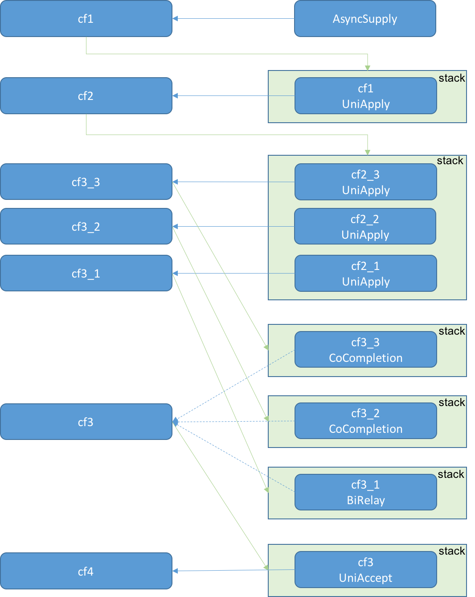

## CompletableFuture原理

在前面的章节中，我们用最基础的Thread和BlockingQueue实现了一个简单的流计算框架。
麻雀虽小，五脏俱全。虽然它很简陋，但我们从中能够了解到一个流计算框架的基本骨架，
即用于传输流数据的队列以及用于处理流数据的线程。
这个框架足够我们做一些业务逻辑不太复杂的功能模块，但是它有以下问题：
1. 能够实现的DAG拓扑结构有限。比如在实现Fork/Join功能时，我们借助了SettableFuture/ListenableFuture的功能。
这样对于DAG拓扑的实现并不纯粹。
2. 给每个节点的计算资源只能静态配置，不能根据实际运行时的状况动态分配计算资源。

为了解决这些问题，在接下来的章节中，我们将采用CompletableFuture类来对上面这个流计算框架进行改造。
但在开始改造之前，还需要先彻底理解CompletableFuture的工作原理。

### CompletableFuture的前世今生
在Java 8中，新增了许多非常有趣的功能，比如lambda表达式、stream api等等。
这些语法糖或API让Java这门"古老"的编程语言也开始具备"现代"的气息。
但是，在这些新功能中，最让笔者觉得耳目一新，并认为其将java平台提高到一个新境界的功能是CompletableFuture。

#### Java 8之前的Future
在Java 8之前，我们都知道用于异步执行的ExecutorService类和代表异步执行结果的Future类。
Future类提供了一个get方法，用于在任务完成时获取任务的结果。
但是，Future类的get方法有个缺点，它是阻塞的。具体而言就是，虽然我们将任务提交给ExecutorService异步执行了，
但还是需要使用get方法来同步等待任务结果。
这就在事实上将原本异步执行的方案，重新退化成了同步执行，失去了原本异步方案的意义。
为了避免这种问题，不同的第三方java库或框架，提供了不同的解决方案。
比如Guava库中的SettableFuture/ListenableFuture，Netty中的Future和ChannelFuture等等。
这些解决方案都是通过注册监听或回调的方式，形成回调链，从而实现了真正意义上的异步执行。

#### Java 8中的CompletableFuture
在借鉴了诸多第三方异步编程方案后，Java 8带来了自己的异步编程方案CompletableFuture。
CompletableFuture也是采用了回调的方式实现异步执行。
而且除了提供基本的回调执行机制外，CompletableFuture还提供了大量有关回调链形成和组织的API，
这些关于回调链形成和组织的API使得Java异步编程变得无比方便和灵活，极大程度地解放了Java异步编程的生产力。

#### 常用的CompletableFuture方法
在前面的章节中，我们已经用到了部分的CompletableFuture方法。下面我们简单地介绍部分CompletableFuture方法。

1. 将产品放到流水线起点上
```
public static <U> CompletableFuture<U> supplyAsync(
    Supplier<U> supplier, Executor executor)
```
CompletableFuture.supplyAsync是开启CompletableFuture异步调用的方法之一。
使用这个方法，会将supplier封装为一个任务提交给executor执行，
并返回一个记录这个任务执行状态和执行结果的CompletableFuture对象。
之后可以在这个CompletableFuture对象上挂接各种回调动作。
所以说它是流水线的起点，将产品原料放在了流水线上。

2. 产品在流水线上的加工
```
public <U> CompletableFuture<U> thenApplyAsync(
    Function<? super T,? extends U> fn, Executor executor)
```
thenApplyAsync用于在CompletableFuture对象上挂接一个转化函数。
当CompletableFuture对象完成时，以其结果作为输入参数调用转化函数。
转化函数内部在执行各种逻辑后，返回另一种类型的数据作为输出。
该方法的返回是一个新的CompletableFuture对象，用于记录转化函数的执行状态和执行结果等信息。
thenApplyAsync的fn参数将一种类型数据转化为另外一种类型数据，
就像流水线上生产工人对半成产品加工处理的过程。

3. 产品在流水线上完成加工后装入仓库
```
public CompletableFuture<Void> thenAcceptAsync(
    Consumer<? super T> action, Executor executor)
```
thenAcceptAsync用于在CompletableFuture对象上挂接一个接收函数。
当CompletableFuture对象完成时，以其结果作为输入参数调用接收函数。
与thenApplyAsync类似，接收函数在其内部可以执行各种逻辑，
但不同的是，接收函数不会返回任何类型数据，或者说返回类型是void。
因此，thenAcceptAsync通常就是接收并消化任务链的最终输出结果。
这就像产品在流水线上完成所有加工后，从流水线上拿下来装进仓库的过程。

4. 在流水线上插入一条新流水线
```
public <U> CompletableFuture<U> thenComposeAsync(
    Function<? super T, ? extends CompletionStage<U>> fn, Executor executor)
```
thenComposeAsync理解起来会复杂些，但它真的是一个非常有用的方法。
thenComposeAsync在API形式上与thenApplyAsync类似，但是它的转化函数返回的不是一般类型的对象，
而是一个CompletionStage对象，或者说得更具体点，实际使用中通常就是一个CompletableFuture对象。
这就意味着，我们可以在原来的CompletableFuture调用链上，插入另外一个调用链，从而形成一个新的调用链。
这正是compose(组成、构成)的含义所在。
而这个过程，就像是在流水线的某个环节处，插入了另外一条流水线。
不过需要注意的是，"插入"这个词带有"已有"和"原来"的意味，但是实际在程序设计和开发时，
并非一定是对旧物的改造，而是说如果某个步骤内部有另外的异步执行过程，
可以直接将这条独立的异步调用链加入到当前调用链中来，成为整体调用链的一部分。

5. 谁先完成谁执行
```
public <U> CompletableFuture<U> applyToEither(
    CompletionStage<? extends T> other, Function<? super T, U> fn)
```
使用applyToEither可以实现两个CompletableFuture谁先完成，就由谁执行回调函数的功能。
比如，可以用该方法实现定时超期的功能。具体而言就是，用一个CompletableFuture表示目标任务，
用另外一个CompletableFuture表示定时任务，这样如果目标任务在定时任务完成前尚未完成，就由定时任务做善后处理。
这里只是列举了一个使用场景，读者可根据自己的需要任意发挥applyToEither的用法。

6. 大家一起完成后再执行
```
public static CompletableFuture<Void> allOf(CompletableFuture<?>... cfs)
```
CompletableFuture.allOf的功能是将多个CompletableFuture合并成一个CompletableFuture。
这又是一个非常有用而且有趣的方法，因为我们可以用它实现类似于map/reduce（或者fork/join）的功能。
而在多核和高并发大行其道的今天，先分散再汇聚的执行流结构是非常普遍的，
CompletableFuture.allOf为我们编写这类模式的执行逻辑提供了非常方便的方式。
在下一章节中，我们就会看到这个方法的实际案例。

7. 异常处理
```
public CompletableFuture<T> exceptionally(
        Function<Throwable, ? extends T> fn)
```
在Java的世界里，异常无处不在。在CompletableFuture中发生异常了会怎样？
实际上，如果不是CompletableFuture提供了exceptionally等异常处理方法，
而是由我们自己在回调函数里做异常处理的话，会非常受限和不方便。稍有不注意，就会写出不合理甚至错误的代码。
比如你认为捕获了的异常，实际上根本就不是在那个地方或那个线程上抛出。
出现这种情况的原因在于，在异步的世界里，即使是同一份代码，实际上在运行起来后，
其调用链生成、回调的执行时刻、回调所在线程和回调的上下文环境都是灵活多变的。
相比以前同步或半异步半同步的编程方式，使用CompletableFuture开发的程序在运行时的状况会更加复杂和多变。
而CompletableFuture的exceptionally方法就为我们提供了相对较好的异常处理方案。
使用exceptionally方法，可以对指定CompletableFuture抛出的异常进行处理。
比如捕获异常并返回一个特定的值，当然也可以再抛出一个异常。


### CompletableFuture工作原理
前面对CompletableFuture的几个常用API做了讲解。但是光知道这些API还是不能真正体会CompletableFuture的奥义和乐趣所在。
下面我们通过一个实验程序来具体分析CompletableFuture的工作原理。考虑下面的实验程序片段：

```
CompletableFuture<String> cf1 = CompletableFuture.supplyAsync(Tests::source, executor1);
CompletableFuture<String> cf2 = cf1.thenApplyAsync(Tests::echo, executor2);
CompletableFuture<String> cf3_1 = cf2.thenApplyAsync(Tests::echo1, executor3);
CompletableFuture<String> cf3_2 = cf2.thenApplyAsync(Tests::echo2, executor3);
CompletableFuture<String> cf3_3 = cf2.thenApplyAsync(Tests::echo3, executor3);
CompletableFuture<Void> cf3 = CompletableFuture.allOf(cf3_1, cf3_2, cf3_3);
CompletableFuture<Void> cf4 = cf3.thenAcceptAsync(x -> print("world"), executor4);
```

调试跟踪并分析以上实验程序，其工作原理图如下：

<div align="center">
<div style="text-align: center; font-size:50%">图3.3 CompletableFuture原理1</div>

</div>

上图描述了实验程序整体的执行过程：
1. 通过CompletableFuture.supplyAsync创建了一个任务Tests::source，并交由executor1异步执行。
用cf1来记录该任务在执行过程中的状态和结果等信息。
2. 通过cf1.thenApplyAsync，指定了当cf1(Tests::source)完成时，需要回调的任务Tests::echo。
cf1使用stack来管理这个后续要回调的任务。与cf1类似，用cf2来记录任务Tests::echo的执行状态和执行结果等信息。
3. 通过连续三次调用cf2.thenApplyAsync，指定了当cf2(Tests::echo)完成时，需要回调后续三个任务：
Tests::echo1、Tests::echo2和Tests::echo3。
与cf1一样，cf2也是用stack来管理其后续要执行的这三个任务。
4. 通过CompletableFuture.allOf，创建一个合并了cf3_1、cf3_2、cf3_3的cf3，cf3只有在其合并的所有cf完成时才能完成。
在cf3内部，是用一个二叉树（tree）来记录其和cf3_1、cf3_2、cf3_3的依赖关系。这点后续会详细描述。
5. 通过cf3.thenAcceptAsync，指定了当cf3完成时，需要回调的任务（print）。用cf4来记录print任务的状态和结果等信息。

总结起来就是：
1. CompletableFuture用stack来管理其在完成（complete）时后续需要回调的任务（Completion）。
2. 在AsyncRun、Completion中，通过依赖（dep）指针，指向后续需要处理的CompletableFuture，
这样在任务完成后，就可以通过dep指针找到后续处理的CompletableFuture，从而继续执行。
3. 通过1和2形成一个调用链，所有任务按照调用链执行。

下面来讲解下CompletableFuture链是如何组织和运行的。

<div align="center">
<div style="text-align: center; font-size:50%">图3.3 CompletableFuture原理3</div>

</div>

整体而言，每个CompletableFuture可以存在三种类型的指针：src、snd和dep。
其中dep指向了这个CompletableFuture在完成（completed）时，后续继续调用的CompletableFuture。
src和snd则指向了其链接的另外的两个CompletableFuture，用于决定是否在CompletableFuture完成时触发dep执行。
为什么是这三个指针呢？考虑一个二叉树，每个节点会连接其父节点和两个兄弟节点，总共有三条边。
而src、snd和dep事实上就是这三条边，它门对应了其指向父节点和两个兄弟节点的关系（如果不存在，就指向自己）。
CompletableFuture内部就是用这三条边巧妙地管理CompletableFuture之间各种复杂的依赖和调用关系的。
对于每个CompletableFuture节点，当其被触发执行时，如果其src和snd（如果存在snd）都是completed状态（src或snd指向自己时也算completed状态），
就触发其dep执行，否则就不触发其dep执行。
但不管这个CompletableFuture是否触发了其dep执行，在tryFire(ASYNC)过后，这个CompletableFuture本身就是已经completed的了。
如果它没有触发dep，就会由该CompletableFuture的src或snd在被触发时按照同样方式做处理。


