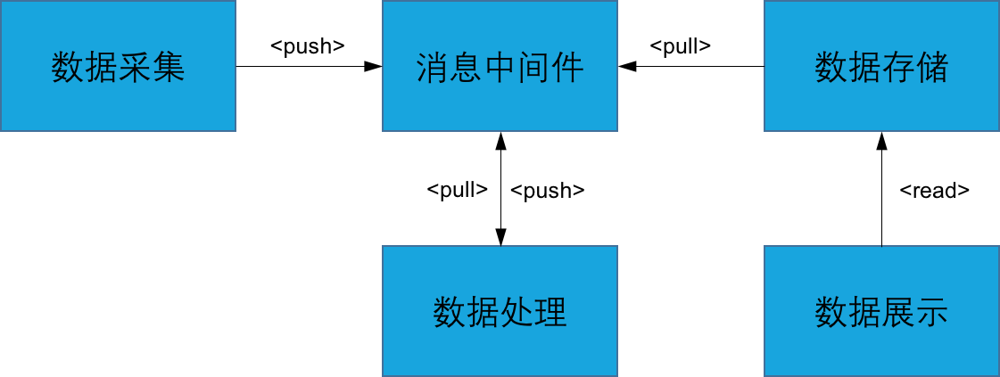
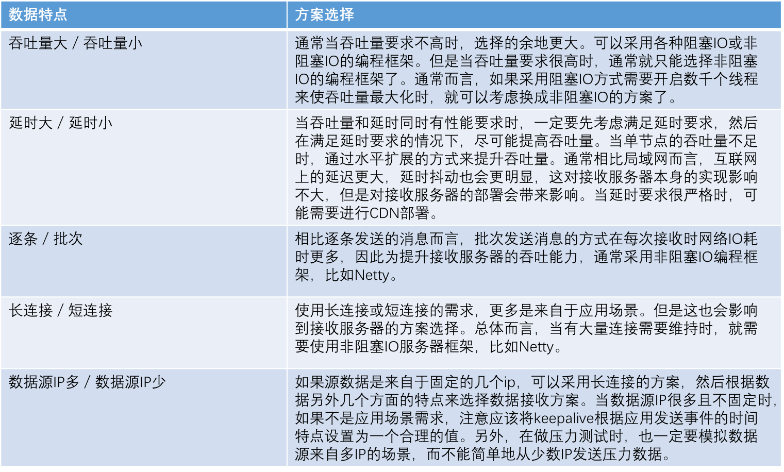

## 实时流计算系统架构

实时流计算系统通常由数据采集、数据传输、数据处理、数据存储和数据展现几个部分组成。

图1. 实时流计算通用架构

### 数据采集
数据采集是接收来自于各种数据源的数据，并将这些数据经过抽取、清洗和转换之后，发送到数据传输系统的过程。

为了使数据接收的性能最优，在设计数据接收方案时，必须充分考虑所接收数据的特点。
比如，数据接收的性能要求如何？数据是逐条发送还是批次发送？客户端到服务器的连接是长连接还是短连接？最大并发连接数是多少？

表1. 接收服务器方案选择

大多数情况下，数据接收服务器选择诸如Netty的非阻塞IO方案会更加合适。
数据接收后，一般还需要做些简单的处理，包括字段抽取、清洗和转化，并组织为特定数据格式，比如JSON或AVRO。
数据组织的结构越简单越好，平坦的数据结构比嵌套式的数据结构更好，嵌套浅的数据结构比嵌套深的数据结构更好。
最后，将格式化数据序列化并发往数据传输系统。

### 数据传输
数据传输是流数据在各个模块间流转的过程。数据传输系统的核心是消息中间件，常用的消息队列中间件有Apache Kafka，RabbitMQ等等。
数据传输系统就像是人体的血管系统，承载着整个实时流计算系统中数据的传输。

选择消息中间件时，需要考虑以下因素：

**吞吐量**：消息中间件每秒钟能够处理的消息数。消息中间件自身的吞吐量决定了实时流计算系统吞吐量的上限，
所以选择消息中间件时，首先得确定消息中间件本身的吞吐量对业务没有明显的限制。
  
**延迟**：消息从发送端到消费端所消耗的时间。如同吞吐量一样，消息中间件自身的延迟决定了实时流计算系统延迟的下限。
选择消息中间件时，得确定消息中间件本身延迟对业务没有明显限制。

**高可用**：消息中间件的一个或多个节点发生故障时，仍然能够持续提供正常服务。
高可用消息中间件必须支持在转移故障并恢复服务后，客户端能自动重新连接并使用服务。
千万不能让客户端进入僵死状态，否则即使消息中间件依然在提供服务，但上层的业务服务已然停止。

**持久化**：消息中间件中的消息写入日志或文件，在重启后消息不丢失。大部分业务场景下，支持持久化是一个可靠线上系统的必要条件。
数据持久化从高可用角度看，还需要提供支持数据多副本存储功能。当一部分副本数据所在节点出现故障，或这部分副本数据本身被破坏时，
可以通过剩余部分的副本数据恢复出来。

**水平扩展**：消息中间件的处理能力能够通过增加节点来提升。
当业务量逐渐增加时，原先的消息中间件处理能力逐渐跟不上，
这时需要增加新节点以提升消息中间件的处理能力。
比如Kafka可以通过增加Kafka节点和topic分区数的方式水平扩展处理能力。

### 数据处理
数据处理是实时流计算系统的核心。从数据传输系统读取数据流后，需要对数据流做处理。
数据处理的目标可以分为四类：数据转化、指标统计、模式匹配以及模型学习和预测。
数据转化包括数据抽取、清洗、转换和加载，比如常见的流式函数filter和map，分别完成数据抽取和转化的操作。
指标统计是在流数据上统计各种指标，比如计数、求和、均值、标准差、极值、聚合、关联、直方图等。
模式匹配是在流数据上寻找预先设定的事件序列模式，我们常说的CEP（复杂事件处理）就属于模式匹配。
模型学习和预测是数据挖掘和机器学习在流数据上的扩展应用，基于流的模型学习算法可以实时动态地训练或更新模型参数，
进而根据模型做出的预测，能更加准确地描述数据背后当时正在发生的事情。

我们通常使用DAG（有向无环图）来描述流计算过程。
常见的开源流处理框架有Apache Storm、Apache Spark、Apache Flink、Apache Samza和Akka Streams等。
在这些流处理框架中，都会使用DAG或类似的概念来表示流计算应用。

[REF](Streaming Queries over Streaming Data[Sirish Chandrasekaran Michael J. Franklin])

### 数据存储
数据存储方案的选型要充分考虑计算类型和查询目标。由于实时流数据的无限性和实时性特点，针对流处理的算法经常需要专门设计。

比如针对"过去一天同一设备上登录的不同用户数"这种查询目标，
在数据量较小时，使用传统关系型数据库（RBDM）和结构化查询语言（SQL）是个不错的选择。
但当数据量变得很大后，这种基于关系型数据库的方案会变得越来越吃力，直到最后根本不可能在实时级别的时延内完成查询。

相同的查询目标，采用NoSQL数据库却不仅能够做到实时查询，还能获得更高的吞吐能力。相比传统SQL数据库，实时流计算中会更多地使用NoSQL数据库。
越来越多的NoSQL数据库开始提供类似于SQL的查询语言，但查询语言不是数据库的本质所在，数据库的本质是底层的查询执行和数据存储。
选择数据存储方案时，上层查询语言的通用性和易用性是重要考虑因素。但更重要的是，所选数据库的查询和存储本身能够贴合所要进行查询的计算复杂度。

除了实时流计算过程中需要使用数据库外，数据本身和计算结果通常需要保存起来，以做数据备份、离线报表或离线分析等。
离线数据存储一般选择诸如HDFS的分布式文件系统。特别是如今Hadoop已经非常成熟，构建在其上的查询和分析工具多种多样，
比如MapReduce、Hive和Spark等都是非常好的分析工具。
这些工具统一在Hadoop生态体系内，对以后更多的工具选择留下很大的余地。

如果需要针对实时流计算结果构建实时点查询服务，即根据一个或多个健来查询一条特定的实时流计算结果记录，
可以选择NoSQL数据库并配置缓存的方案来实现。

有时候实时流计算的结果使用UI呈现。很多UI会提供交互式查询体验，这就涉及一类我们称之为Ad-Hoc的查询。
用于Ad-Hoc查询的存储方案，在设计时一定要考虑UI可能的需求变化，而不能选择一个僵硬的数据存储方案。
否则当未来UI需求变化、各种查询条件调整时，后端数据库变更将是个巨大而且痛苦的挑战。
这种情况下，使用搜索引擎一类的存储方案比如ElasticSearch，会是个明智的选择。

综合而言，在相对复杂的业务场景下，实时流计算只是系统中的一个环节。针对不同计算类型和查询目的，要合理选择相应的数据存储方案。
更有甚者，很多时侯必须将相同内容的数据需要根据不同的需求，同时存入多种不同功能的存储方案中。
至少目前为止，还没有一种称之为"银弹"的数据库。

在后面章节中，我们将详细讨论各种数据存储方案。

#TODO：增加各种数据库的对比表格。

### 数据展现
数据展现的目的是将数据呈现给最终用户。数据呈现的形式可以是API，也可以是UI。
API通常以REST服务提供，而UI则主要以Web UI的方式实现。
在移动终端大行其道的今天，诸如手机的客户端应用程序，也是常用的数据呈现方式。
以Web UI而言，基于Web的数据展现方案有很多优点。
一方面，部署简单，只需提供Web服务器即可在浏览器中访问。
另一方面，各种丰富的前端框架和数据可视化框架，为开发提供更多的选择的方便。
比如常用前端框架有React、Vue、Angular等，数据可视化框架则有ECharts、D3.js等等。
数据可视化是数据展现的核心，相关内容也丰富多彩，但不是本书的重点。读者可以查阅其它相关资料，在此不做赘述。

### 总结
本节讲解了实时流计算系统的通用架构。
数据传输贯穿整个实时流计算系统，将数据接收、数据处理和数据存储连接起来，数据展现则构建在数据存储之上。
在本书后面的章节中将逐一讨论实时流计算系统各部分内容。
