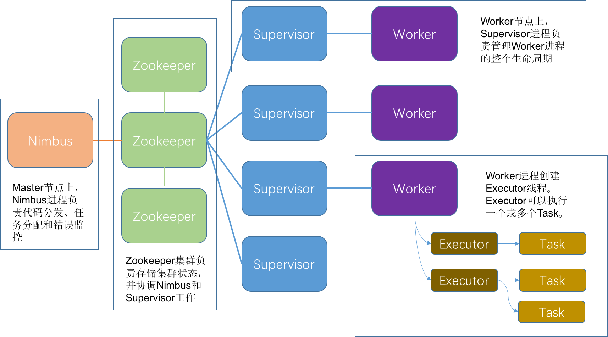

## Apache Storm

Apache Storm(后简称Storm)是一款由Twitter开源的大规模分布式流计算平台。
Storm出现得较早，是分布式流计算平台的先行者。不过随着各种流计算平台后起之秀崛起，Storm也在不断尝试着改进和改变。

### 系统架构
Storm集群由两种类型节点组成，即Master节点和Worker节点。
其中Master节点上运行Nimbus进程，Woker节点上运行Supervisor进程和Worker进程。
另外，Nimbus和Worker之间还需要通过Zookeeper来共享流计算作业状态，并协调作业调度和执行。

<div align="center">

<div style="text-align: center; font-size:50%">img7.1.Storm系统架构图</div>
</div>

### 流的描述
Storm中通过Topology、Tuple、Stream、Spout和Bolt等概念来描述一个流计算作业。

Topology：也就是前面章节中我们用来描述流计算作业的DAG，它完整地描述了流计算应用的执行过程。当Topology部署在Storm集群上并开始运行后，
除非明确停止它，否则它会一直运行下去。这和MapReduce作业在完成后就退出了的行为是不同的。
Topology由Spout、Bolt和连接它们的Stream构成，其中Topology的节点对应着Spout或Bolt，而边则对应着Stream。

Tuple：用于描述Storm中的消息，一个Tuple就可以视为一条消息。

Stream：这是Storm中的一个核心抽象概念，用于描述消息流。Stream由Tuple构成，一个Stream可以视为一组无边界的Tuple序列。

Spout：用于表示消息流的输入源。Spout从外部数据源中读取数据，然后将其发送到消息流中。

Bolt：是Storm进行消息处理的地方。Bolt负责了消息的过滤、运算、聚类、关联、数据库访问等等各种逻辑。
开发者就是在Bolt中实现各种流处理逻辑。

### 流的执行
流的执行是指流计算应用中，输入的数据流，经过处理，最后输出到外部系统的过程。
通常情况下，一个流计算应用会包含多个执行步骤，并且这些步骤的执行步调极有可能不一致。
因此，还需要用反向压力来实现不同执行步骤间的流控。

早期版本的Storm使用TopologyBuilder来开始构建流计算应用。
但是以新一代流计算框架的角度来看，基于TopologyBuilder的API在实际使用时并不直观和方便。
所以与时具进的Storm从2.0.0版本开始，提供了更加现代的流计算应用接口Stream API。
虽然目前Stream API仍然是实验阶段，但是如果是新开发一个Storm流计算应用，还是建议直接开始使用Stream API。
因为这种风格的流计算编程接口才是流计算应用开发的未来。在接下来的讨论中，我们就直接基于更新的Stream API。

下面，我们从流的输入、流的处理、流的输出和反向压力四个方面来讨论Storm中流的执行过程。

#### 流的输入
Storm从Spout中输入数据流，并提供了StreamBuilder来从Spout构建一个流。
下面是一个典型的用StreamBuilder从Spout构建Stream的例子。

```
public class DemoWordSpout extends BaseRichSpout {
    // 忽略了其它字段和方法，只展示nextTuple方法的实现
    public void nextTuple() {
        final String[] words = new String[]{ "apple", "orange", "banana", "mango", "pear" };
        final String word = words[new Random().nextInt(words.length)];
        _collector.emit(new Values(word));
        // Thread.sleep(1000);
    }
}

StreamBuilder builder = new StreamBuilder();
Stream<String> words = builder.newStream(new DemoWordSpout(), new ValueMapper<String>(0));
```

Spout的核心方法是nextTuple，从名字上就可以看出这个方法是在逐条从消息源读取消息，并将消息表示为Tuple。
不同的数据源的nextTuple方法实现方式并不相同。
另外，Spout还有两个与消息传递可靠性和故障处理相关的方法ack和fail。
当消息发送成功时，可以调用ack从发送消息列表中删除已成功发送的消息。
当消息发送失败时，则可以在fail中尝试重新发送或在最终失败时做出合适处理。

#### 流的处理
Storm的Stream API，与更新一代的Spark Streaming和Flink等框架更加相似。
Stream提供的API总体包括三类，一类是常用的流式处理操作，比如filter、map、reduce、aggregate等。
另一类是流数据状态相关的操作，比如window、join、cogroup等。
还有一类是流信息状态相关的操作，目前有updateStateByKey和stateQuery。

下面是一个对Stream进行处理的例子。

```
wordCounts = words
    .mapToPair(w -> Pair.of(w, 1))
    .countByKey();
```
在上面的例子中，先用`mapToPair`将单词流`words`转化为计数元组流，
然后再通过`countByKey`转化为了单词计数流`wordCounts`。


#### 流的输出
Storm的Stream API提供了将流输出到控制台、文件系统或数据库等外部系统的方法。
目前提供的输出操作包括print、peek、forEach和to四个。
其中peek是对stream的完全原样中继，并可以在中继时提供一段操作逻辑，因而peek方法可以用于方便地检测stream在任意阶段的状况。
forEach方法是最通用的输出方式，可以执行任意逻辑。
to方法则允许将一个bolt作为输出方法，可以方便地继承早期版本中已经存在的各种输出bolt实现。
下面的例子演示了将单词计数流打印到控制台。

```
wordCounts.print();
```

#### 反向压力
Storm支持反向压力。早期版本的Storm通过开启acker机制和max.spout.pending参数实现反向压力。
当下游Bolt处理较慢，Spout发送出但没有被确认的消息数超过max.spout.pending参数时，Spout就暂停消息发送。
这种方式实现了反向压力，但却有个不算轻微的缺陷。
一方面，静态配置max.spout.pending参数很难使得系统在运行时有最佳的反向压力性能表现。
另一方面，这种反向压力实现方式本质上只是在消息源头对消息发送速度做限制，而不是对流处理过程中各个阶段做反向压力，
它会导致系统的处理速度发生比较严重的抖动，降低系统的运行效率。

在较新版本的Storm中，除了监控Spout发送出但没有被确认的消息数外，还监控每级Bolt接收队列的消息数量。
当消息数超过阈值时，通过Zookeeper通知Spout暂停消息发送。这种方式实现了流处理过程中各个阶段反向压力的动态监控，
能够更好地在运行时调整对Spout的限速，降低了系统处理速度的抖动，也提高了系统的运行效率。


### 流的状态
在前面的章节中，我们将流的状态分成两种：流数据状态和流信息状态。

#### 流数据状态
流数据状态方面，早期版本的Storm提供了Trident、窗口（window）和自定义批处理三种有状态处理方案。
Trident将流数据切分成一个个的元组块（Tuple Batch），并分发到集群中处理。
Trident针对元组块的处理，提供了过滤、聚合、关联、分组、自定义函数等功能。
特别是聚合、关联、分组等功能在实现过程中，涉及状态保存的问题。
另外，Trident在元组块处理过程中还可能失败，失败后需要重新处理，这个过程也会涉及状态保存和事务一致性问题。
因此Trident有针对性地提供了一套状态接口（Trident State API）来处理状态和事务一致性。
Trident支持三种级别的Spout和State：Transactional、Opaque Transactional和No-Transactional。
其中Transactional提供了强一致性保证，Opaque Transactional提供了弱一致性，No-Transactional无一致性保证。

Storm支持Bolt按窗口处理数据，目前实现的窗口类型包括了滑动窗口（Sliding Window）和滚动窗口（Tumbling Window）。

Storm还支持自定义批处理方式。Storm系统内置了定时消息机制，通过每隔一段时间向Bolt发送嘀嗒元组（tick tuple），
Bolt在接收到嘀嗒元组后，可以根据需求自行决定什么时候处理数据、处理哪些数据等等，在此基础上就可实现各种自定义的批处理方式。
比如，可以通过tick实现窗口功能（当然Storm本身已经支持），或实现类似于Flink中watermark的功能（Storm本身也已经支持）等等。

从2.0.0版本引入的Stream API已经提供window、join、cogroup等流数据状态相关的API，
这些API更加通用，使用起来也更方便，因此再次建议读者直接使用这类API来开发Storm流计算应用。

#### 流信息状态
流信息状态方面，早期版本Storm中的Trident状态接口就包含了对流信息状态的支持，并且还支持了三种级别的事务一致性。
比如使用Trident状态接口，可以实现word counts的功能。
但是Trident状态与Trident支持的处理功能耦合太紧，这使得Trident状态接口的使用并不通用。
比如在非Trident的Topology中就不能够使用Trident状态接口了。
所以，当使用Storm做实时流计算时，经常需要用户自行实现对流信息状态的管理。比如，使用Redis来记录事件发生的次数。
不过，最新版本Storm的Stream API已经逐渐开始引入更通用的流信息状态接口，目前提供的updateStateByKey和stateQuery就是这种尝试。

### 消息传达可靠性保证

Storm提供了不同级别的消息可靠性保证，包括尽力而为（best effort）、至少一次（at least once）和通过Trident实现的精确一次（exactly once）。
在Storm中，一条消息被完全处理，是指代表这条消息的元组以及由这个元组生成的子元组、孙子元组以及各代重孙元组都被成功处理。
反之，只要这些元组中有任何一个元组在指定时间内处理失败，那就认为这条消息是处理失败的。
不过，要使用Storm的这种消息完全处理机制，需要在程序开发时，配合Storm系统做两件额外的事情。
首先，当在处理元组过程中生成了子元组时，需要通过ack告知Storm系统，
其次，当完成对一个元组的处理时，也需要通过ack或fail告知Storm系统。

在具体业务逻辑开发过程中，用户根据业务需要选择合理的消息保证级别实现即可。
很多场景下并非一定要保证严格的数据一致性，毕竟越严格的消息保证级别，通常实现起来也会越复杂，性能损耗也会更大。
